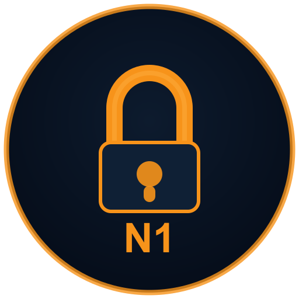
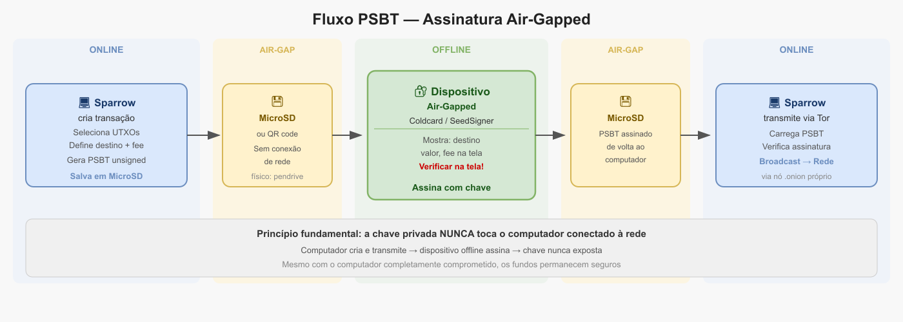

# Capítulo 6 — Nível 1: O Cofre

{fig-align=center width=30mm}

> "O dispositivo que guarda o segredo"

---

## Objetivo

Adquirir e configurar um dispositivo **air-gapped** (sem WiFi, Bluetooth ou USB de dados durante a assinatura) como guardião das chaves privadas. A seed **nunca** tocará um computador conectado à rede.

**Tempo estimado:** 1–2 semanas | **Dificuldade:** 3/5

**Pré-requisitos:** Nível 0 concluído.

> **Labs:** `01-hw-wallet-inicializacao` → `02-teste-restauracao` (**obrigatório**) → `03-psbt-via-qr` — pasta `laboratorio/nivel-1-cofre/`.

> **Mapa ambientes:** seed só no HW — Cap. **13.4**, Ap. **H**.

---

### Passo 1.0 — Escolher seu dispositivo

Você tem opções. Escolha UMA:

**COLDCARD MK5 (Recomendado)** — ~US$ 170

- Padrão ouro da comunidade
- Assina via SD card (PSBT) ou QR
- Trick PIN / Brick PIN: PIN alternativo abre decoy ou apaga seed (manual Coinkite)
- Carteira de coerção (duress), Bitcoin-only, open source
- Ideal: quem quer o melhor

**BLOCKSTREAM JADE PLUS (Econômico)** — ~US$ 169

- Câmera para QR airgap
- Open source, preço acessível
- Ideal: orçamento limitado

**FOUNDATION PASSPORT BATCH 2 (QR)** — ~US$ 150–200

- QR nativo, UX mais amigável
- Open source, modular
- Ideal: prefere QR a SD card

**SEEDSIGNER (DIY)** — ~US$ 50 em peças

- Raspberry Pi Zero + câmera
- Stateless (apaga a seed da memória ao desligar)
- Você monta e verifica cada componente
- Ideal: quer construir o próprio

**KRUX (DIY Firmware)** — ~US$ 40–60 em hardware

- Firmware para Maix Amigo, M5StickV
- Stateless, suporte a Taproot
- Builds reproduzíveis
- Ideal: alternativa moderna ao SeedSigner

---

### Passo 1.1 — Adquirir sem vínculo ao seu nome

- [ ] Coldcard: coinkite.com (fabricante oficial)
- [ ] Jade Plus: blockstream.com
- [ ] Passport: foundationdevices.com
- [ ] SeedSigner: comprar peças em lojas de eletrônica
- [ ] Krux: comprar Maix Amigo/M5StickV ou flashear firmware
- [ ] Se possível, pagar com BTC (mais privacidade)
- [ ] Ou cartão presente (gift card)
- [ ] Enviar para endereço sem seu nome:
  - PO Box (caixa postal)
  - Casa de um amigo ou familiar
  - Receber em mãos (se loja física)

### Dica de João

João pediu o Coldcard com cartão-presente de supermercado e recebeu na caixa postal do condomínio — nenhum elo direto com o CPF dele. "Parece paranoia", disse, "até você ver quanta gente perde privacidade no checkout."

---

### Passo 1.2 — Verificar integridade física

- [ ] Conferir embalagem:
  - Bag antiviolação intacta (Coldcard/Jade)
  - Sem rasgos, furos, sinais de abertura
  - Número de série na caixa = número na tela do dispositivo
- [ ] Se for DIY (SeedSigner/Krux):
  - Comprar peças de fornecedores diferentes
  - Verificar se os chips não estão adulterados
  - Flashear firmware você mesmo
  - Verificar hash do firmware (build reproduzível)
- [ ] Se HOUVER suspeita: DEVOLVER, não usar

---

### Passo 1.3 — Atualizar firmware (air-gapped)

- [ ] Em computador COM internet:
  - Baixar firmware mais recente do site oficial
  - Verificar assinatura PGP do firmware
  - Copiar para MicroSD
- [ ] MicroSD → dispositivo → opção Upgrade Firmware
- [ ] Confirmar versão na tela
- [ ] NUNCA conectar o dispositivo à internet via USB

---

### Passo 1.4 — Inicializar com dice rolls

- [ ] Dispositivo → New Wallet → Dice Rolls (nova seed / lançamentos de dados)
- [ ] Lance os dados **de novo no dispositivo** (100+ entradas) — **não** reutilize os números do exercício Passo 0.4; aqui nasce a seed **definitiva**
- [ ] Se preferir papel auxiliar: anote lançamentos **novos**, depois digite no HW
- [ ] Inserir um por um, conferindo na tela
- [ ] Dispositivo gera 24 palavras BIP39
- [ ] NUNCA usar "Quick Generate" (RNG interno do chip — você confia no fabricante)
- [ ] Anotar as 24 palavras EM PAPEL (temporário — metal no Passo 1.6b)

---

### Passo 1.5 — Adicionar passphrase

- [ ] Dispositivo → Passphrase → Add Passphrase
- [ ] Digitar a passphrase que você criou no Nível 0
- [ ] Dispositivo mostra "Passphrase: Set"
- [ ] Agora sua carteira REAL está ativa
- [ ] Sem passphrase = carteira **diferente** (decoy — proteção sob coerção)

---

### Passo 1.6 — Validar endereços (OFFLINE)

- [ ] Exportar xpub (chave pública estendida — não gasta fundos) para MicroSD ou QR
- [ ] Verificar hash SHA256 do bip39.html antes de abrir (mesmo arquivo do Nível 0)
- [ ] Em computador OFFLINE, nunca conectado à internet, com bip39.html:

> **AVISO — única exceção à Lei 4 (nunca digitar seed em PC):** validação em máquina dedicada offline. Apague o histórico do navegador após. Alternativa futura: comparar só xpub exportado, quando o dispositivo permitir.

- [ ] Inserir 24 palavras + passphrase
- [ ] Verificar se o primeiro endereço BIP84 / Native SegWit (m/84'/0'/0'/0/0, bc1…) **BATE EXATAMENTE** com o endereço mostrado no dispositivo
- [ ] Verificar 5º e 15º endereços também
- [ ] Se NÃO bater: ALGO ERRADO. Recomece.

---

### Passo 1.6b — Gravar seed em metal (obrigatório antes do Passo 1.7)

> **Ordem crítica:** faça **antes** do teste destrutivo (1.7). Se apagar a seed do dispositivo sem backup em metal, pode perder tudo.

Siga o **Capítulo 5, Passo 0.5** e o lab `laboratorio/nivel-0-semente/02-backup-aco.md` (repositório do projeto).

- [ ] Conferir as 24 palavras no dispositivo (3 leituras em voz alta)
- [ ] Gravar 2 cópias em metal — Locais Físicos A e B (diferentes)
- [ ] Passphrase permanece em Local C (Capítulo 5, Passo 0.6)
- [ ] Queimar/picar papel temporário das palavras
- [ ] NUNCA: foto, nuvem, email, WhatsApp da seed

---

### Passo 1.7 — Teste de recuperação (CRÍTICO)

> **Lab:** `laboratorio/nivel-1-cofre/02-teste-restauracao.md` — **obrigatório** antes de fundos.

> **Pré-requisito:** Passo 1.6b concluído (2 cópias em metal).

- [ ] Apagar seed do dispositivo (menu varia por modelo):
  - Coldcard: Advanced → Danger Zone → Destroy Seed
  - SeedSigner/Krux: opção equivalente de apagar / factory reset
- [ ] Dispositivo sem seed
- [ ] Import Existing → Restore from 24 words
- [ ] Digitar 24 palavras + passphrase
- [ ] Exportar endereços novamente
- [ ] Comparar com os endereços anotados no Passo 1.6
- [ ] **DEVEM BATER EXATAMENTE**
- [ ] Se NÃO bater: sua seed gravada está ERRADA
  - Regrave a seed em metal
  - Refaça o teste
  - NUNCA envie fundos antes deste teste passar
- [ ] Se SIM: seu backup FUNCIONA. Pode confiar.

---

### Verificação do Nível 1

**Obrigatório antes de enviar fundos:**

- [ ] Endereços validados offline (Passo 1.6)
- [ ] 2 backups em metal + passphrase em local separado (Passo 1.6b / Cap. 5)
- [ ] Teste de restauração bem-sucedido (Passo 1.7)

**Opsec contínua:**

- [ ] Dispositivo air-gapped configurado e funcional
- [ ] Firmware atualizado (PGP verificado)
- [ ] Seed gerada com dados físicos, não RNG interno
- [ ] Sei que sem passphrase = carteira decoy diferente
- [ ] Nunca conectei o dispositivo à internet

---

## Conquista: "O Cofre"

> Meu dispositivo é uma fortaleza offline. Se perdê-lo, a semente de aço me salva. Se me coagirem, a passphrase me protege. O cofre está selado e testado.

---

## Leitura opcional — após Níveis 1–2

As seções abaixo aprofundam catálogo de hardware, fluxo PSBT e comparativo DIY. **Não são obrigatórias** para concluir o Nível 1.

---

### Referência rápida — hardware air-gapped

Catálogo completo e alternativas: **Capítulo 14** (leia **14.0** antes de trocar de marca) e **Apêndice G**.

| Dispositivo | Tipo | Comunicação | Notas |
| --- | --- | --- | --- |
| Coldcard MK5 | Comercial | SD / QR | Recomendado — Passo 1.0 |
| Blockstream Jade Plus | Comercial | QR | Econômico, Bitcoin-only |
| Foundation Passport B2 | Comercial | QR / microSD | UX amigável |
| SeedSigner | DIY | QR | Stateless, ~US$ 50 em peças |
| Krux | DIY | QR / SD | K210, builds reproduzíveis |

Outros (Keystone, NGRAVE, ELLIPAL, Specter DIY): ver Cap. 14 — fora do guia inicial para não paralisar a escolha.

**Ferramentas offline:** Ian Coleman BIP39 (HTML standalone, verificar SHA256), rolls.py para dice rolls — **sempre** em máquina air-gapped ou Tails offline.

---

### Fluxo PSBT (visão geral)

**PSBT** (*Partially Signed Bitcoin Transaction* — transação parcialmente assinada): o **coordenador** (Sparrow/Electrum) prepara a transação; o dispositivo air-gapped assina offline.

1. **Coordenador cria a transação (online)** — só conhece a xpub; gera PSBT ou QR.
2. **Transferência air-gapped** — QR animado (UR/BBQR) ou arquivo em SD card.
3. **Dispositivo verifica e assina (offline)** — você confirma endereço, valor e taxa.
4. **Devolução da PSBT assinada** — QR ou SD de volta ao coordenador.
5. **Broadcast via Tor** — chaves privadas nunca tocaram o PC online.

{fig-align=center width=92%}

**Backup:** metal + SeedQR opcional (SeedSigner, Krux, Jade, Passport). Teste de recuperação **antes** de enviar fundos.

---

## Tutorial: Fluxo PSBT via QR — após Capítulo 7

> **Pré-requisitos:** Tails + Sparrow instalados (Capítulo 7). Lab: `laboratorio/nivel-1-cofre/03-psbt-via-qr.md`

**Fluxo PSBT via QR com Sparrow + dispositivo air-gapped (SeedSigner ou Krux)**

Este é o **fluxo padrão air-gapped** usado pela comunidade em 2026. Funciona excelente no **Tails OS** com Sparrow persistente.

### Pré-requisitos

* Sparrow Wallet configurado no Tails (carteira somente leitura — watch-only).
* Carteira criada com o **xpub/zpub** do SeedSigner/Krux (Air-gapped Hardware Wallet).
* Seed gerada **offline** no dispositivo air-gapped.
* Câmera funcionando no Tails (webcam do laptop).

---

### Passo a passo — Sparrow (Tails, online)

1. Abra a carteira **somente leitura** (watch-only).
2. Aba **Enviar** (Send).
3. Preencha endereço de destino, quantia e taxa (fee rate — use **Calcular** ou defina manualmente).
4. **Criar transação** (Create Transaction).
5. Revise inputs, outputs, taxa e endereço de troco (change address).
6. **Finalizar para assinatura** (Finalize Transaction for Signing).

### Exportar PSBT como QR (Sparrow)

* Clique em **Mostrar QR** (Show QR) ou **Mostrar BBQR** se a transação for grande.
* Sparrow usa **UR** ou **BBQR** (QR animado) para PSBTs grandes.
* Deixe a tela exibindo o QR animado.

### No dispositivo air-gapped (SeedSigner ou Krux)

* **SeedSigner:** Ligue → **Assinar → PSBT → Escanear QR** → confira endereços e valores → assine → mostre o QR assinado.
* **Krux:** **Assinar → PSBT → Carregar da câmera** → revise → **Assinar para QR**.

### Importar PSBT assinada de volta no Sparrow

1. No Sparrow, **Escanear QR** (Scan QR / Scan BBQR).
2. Aponte a webcam para o QR do dispositivo.
3. Verifique as assinaturas («1 de 1» ou o número correto no multisig).
4. **Transmitir transação** (Broadcast Transaction).

---

### Dicas Importantes de Segurança e Usabilidade

* **QR Animado (BBQR/UR)**: Sparrow e os signers DIY lidam bem com transações grandes dividindo em múltiplos QRs ou usando animação. Mantenha a câmera estável e boa iluminação.
* **Teste primeiro**: Faça com valores muito pequenos (Ex.: 0,0001 BTC) várias vezes até se sentir confortável.
* **Multisig**: O fluxo é o mesmo. Você assina com um signer, depois com o outro (pode usar o mesmo dispositivo com seeds diferentes ou dispositivos diferentes).
* **Problemas comuns**:
 * QR não escaneia → Ajuste distância, iluminação ou tente "Scan Static QR" se aplicável.
 * Transação grande → Sparrow usa automaticamente o formato fountain code.
* **No Tails**: Certifique-se de que a webcam está habilitada (Applications → Webcam).

### Vantagens deste Fluxo

* Totalmente **air-gapped** (chaves nunca saem do signer).
* Sem USB, sem SD card (mais simples e seguro).
* Excelente integração Sparrow + SeedSigner/Krux.

---

## Comparativo: SeedSigner vs Krux (opcional)

> Lab detalhado: `laboratorio/nivel-1-cofre/04-seedsigner-vs-krux-opcional.md`

**SeedSigner e Krux — alternativas DIY air-gapped para Sparrow no Tails**

Esses dois projetos são **excelentes opções open-source e baratas** para quem não quer comprar hardware wallet comercial (Coldcard, Jade etc.). Ambos permitem **assinatura air-gapped** (via QR) e integram com **Sparrow Wallet** no Tails.

### Comparação Rápida (2026)

| Aspecto | **SeedSigner** | **Krux** |
| --- | --- | --- |
| **Custo** | ~US$ 30–50 (Pi Zero + peças) | ~US$ 15–60 (Maix, M5StickV) |
| **Dificuldade** | Média (montagem) | Fácil a média (placas plug-and-play) |
| **Stateless** | Sim | Sim (ou SD criptografada) |
| **Integração Sparrow** | PSBT via QR | PSBT via QR/SD |
| **Melhor para** | DIY completo, máxima stateless | Começar rápido, menos montagem |

Ambos suportam multisig, BIP39, passphrase e export de xpub para carteira watch-only no Sparrow.

### Recomendação

* **Krux** se quiser algo mais simples de adquirir e flashear.
* **SeedSigner** se preferir montagem completa e stateless estrito.
* Fluxo: montar/flashear → seed offline (dice rolls) → metal + teste restore → Sparrow watch-only + PSBT via QR (tutorial acima).

Sites: [seedsigner.com](https://seedsigner.com) · [selfcustody.github.io/krux](https://selfcustody.github.io/krux)

**Segurança:** compre peças de fontes confiáveis, verifique hashes, teste com valores mínimos antes de depositar.

---

No próximo capítulo, criaremos a carteira fria somente leitura (watch-only) no Tails para enxergar o saldo sem expor a seed.
