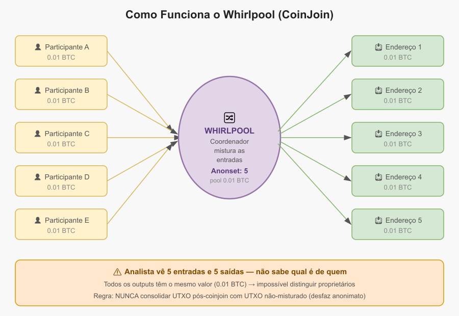

# Capítulo 9 — Nível 4: O Misturador

> "Desaparecendo na multidão"

---

## Objetivo

Dominar CoinJoin com Whirlpool. Ter alternativa funcional com JoinMarket. Aprender controle de moedas (Coin Control) para nunca se auto-sabotar.

**Tempo estimado:** 2–4 semanas | **Dificuldade:** 4/5

**Pré-requisitos:** Nível 3 concluído + pelo menos 0,01 BTC na carteira.

---

> **Ambiente:** o Whirlpool exige uptime e persistência — este nível assume **Whonix** (Capítulo 8). Mixagem pontual ocasional: Tails; remixes automáticos ao longo de dias: Whonix. Tabela completa Tails vs Whonix: Cap. 8, seção *Referência: Tails vs Whonix*.

---

### Passo 4.1 — Estudar CoinJoin

Conceitos para pesquisar antes de começar:

- [ ] O que é CoinJoin?
  - Transação onde várias pessoas misturam seus Bitcoins
  - Depois da mistura, não dá para saber qual input veio de quem
  - Como jogar moedas num pote, chacoalhar e cada um tirar de volta

- [ ] O que é anonset (anonymity set)?
  - Número de pessoas com quem você se misturou
  - Anonset 5 = analista vê 5 possíveis donos
  - Anonset 50 = analista vê 50 possíveis donos
  - Quanto maior, melhor

- [ ] O que é common-input-ownership heuristic?
  - Regra que analistas usam: "todos os inputs de uma transação pertencem à mesma pessoa"
  - CoinJoin quebra essa regra
  - Mas se você CONSOLIDAR outputs pós-coinjoin, recria o vínculo

- [ ] Diferença: Whirlpool vs JoinMarket
  - Whirlpool: coordenador central (.onion), pools fixos, mais fácil
  - JoinMarket: P2P descentralizado, qualquer valor; makers ganham taxas

---

### Passo 4.2 — Criar estrutura de 3 carteiras

- [ ] Todas usam a MESMA xpub (mesmo dispositivo air-gapped)
- [ ] São só "visões" diferentes dos mesmos fundos

- [ ] Carteira 1: "Whirlpool_Whonix" (Premix)
  - UTXOs que serão misturados
  - Status: "sujo" — NÃO gaste fora do Whirlpool

- [ ] Carteira 2: "Postmix_Whonix" (Postmix)
  - UTXOs que já completaram CoinJoin (anonset ≥ 5)
  - Status: "limpo" — pronto para uso privado

- [ ] Carteira 3: "Swap_Ready_Whonix"
  - UTXO isolado e rotulado, pronto para swap (Cap. 10)
  - Status: "reservado"

- [ ] REGRA DE OURO:
  - NUNCA consolidar UTXO pós-coinjoin com UTXO não misturado
  - Isso desfaz TODO o anonimato conquistado

---

### Passo 4.3 — Configurar Whirlpool no Sparrow

- [ ] Aba Whirlpool → Configurações (Settings)
- [ ] Coordenador (Coordinator): automático via Sparrow + Tor (Apêndice B — não use .onion de listas não verificadas)
- [ ] Escolher pool: 0,01 BTC (recomendado para começar)
- [ ] Anonset alvo (target anonset): 5 (mínimo), 10+ (ideal)
- [ ] Modo: remix automático (continua misturando após cada round)

---

### Passo 4.4 — Primeira transação Premix

- [ ] Selecionar 1 UTXO não misturado (0,01 BTC ou mais)
- [ ] Botão direito → Mix to Whirlpool (Misturar no Whirlpool)
- [ ] Escolher pool 0,01 BTC
- [ ] Revisar:
  - Outputs de pool (Ex.: 1 output de 0,01 BTC)
  - Troco (change) que volta para você
  - Taxa do coordenador (coordinator fee)
- [ ] Criar PSBT → dispositivo air-gapped assina → transmitir
- [ ] Aguardar 1 confirmação

---

### Passo 4.5 — Mixagem (deixar rodando)

- [ ] Aba Whirlpool → Iniciar (Start)
- [ ] Aguardar:
  - "Registered" (Registrado) → output registrado no coordenador
  - "Signing" (Assinando) → round em andamento
  - "Remixing" (Remixando) → completou 1 round, voltou para mais

- [ ] Tempos típicos:
  - 1 round: 20–60 minutos
  - 5 rounds: 2–8 horas
  - 10 rounds: 5–20 horas

- [ ] Deixar a VM rodando (não desligar durante round ativo)
- [ ] Whonix é ideal para isso — pode ficar 24/7
- [ ] Usar snapshots: tirar antes de cada sessão longa

---

### Passo 4.6 — Mover para Postmix

- [ ] UTXOs com anonset ≥ 5 → ícone azul no Sparrow
- [ ] Selecionar → Send to Postmix_Whonix (Enviar para Postmix)
- [ ] Assinar no dispositivo air-gapped → transmitir
- [ ] Agora você tem BTC "limpo"!
- [ ] NUNCA gastar este BTC junto com BTC não misturado

---

### Passo 4.7 — Instalar e TESTAR JoinMarket (backup)

> Lab: `laboratorio/nivel-4-misturador/03-joinmarket-opcional.md` · alternativas: **Capítulo 14**

- [ ] NÃO basta instalar — precisa TESTAR
- [ ] clonar JoinMarket no Whonix (git clone)
- [ ] Configurar para Tor
- [ ] Fazer 1 coinjoin de teste (valor pequeno — Ex.: 50.000 sats)
- [ ] Confirmar que funciona como alternativa

- [ ] Se o coordenador Whirlpool cair:
  - Você NÃO fica parado
  - Abre o JoinMarket e continua mixando

- [ ] Anotar comandos essenciais no KeePassXC (metadados — sem seed):
  - wallet-tool.py generate
  - sendpayment.py (tomador / taker)
  - yield-generator.py (maker — ofertante, opcional)

---

### Passo 4.8 — Praticar Coin Control

> **Coin Control** = seleção manual de quais UTXOs entram em cada transação (no Sparrow: aba UTXOs).

- [ ] Congelar UTXOs "sujos" (Congelar / Freeze no Sparrow)
- [ ] Rotular TUDO:
  - "KYC Exchange X" (se algum dia usou)
  - "RoboSats 2026-06"
  - "CJ Round 3" (coinjoin)
  - "Swap Ready"
- [ ] NUNCA usar "Enviar máximo" (Send Max) sem verificar quais UTXOs selecionados
- [ ] Auto-auditar: OXT Explorer **somente via Tor** — ver clusters dos **seus** endereços; não cole endereços em sites clearnet

---

### Verificação do Nível 4

**Obrigatório antes de usar fundos pós-coinjoin:**

- [ ] Primeiro UTXO pós-coinjoin com anonset ≥ 5
- [ ] Coin Control dominado (congelar, rotular, não consolidar)
- [ ] Entendo o que é anonset e como ele sobe
- [ ] Sei que consolidar UTXOs pós-coinjoin = PERDER anonimato

**Ambiente e backup:**

- [ ] Estrutura de 3 carteiras funcionando
- [ ] JoinMarket instalado E testado com valor pequeno
- [ ] Whonix rodando remixes sem desligar VM no meio do round

---

## Conquista: "O Misturador"

> Meus Bitcoins dançam na multidão. A cada rodada, somem mais entre os pares. O analista olha e vê dezenas — não sabe qual sou eu. E se o maestro parar, tenho outra dança pronta.

---

No próximo capítulo, atravessaremos a ponte da privacidade com swaps BTC↔XMR.
