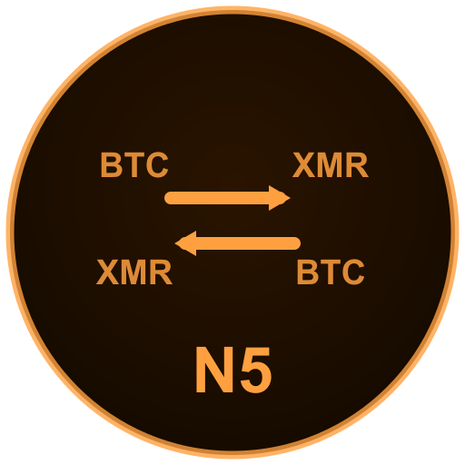

# Capítulo 10 — Nível 5: O Trocador

{fig-align=center width=30mm}

> "A ponte entre mundos"

---

## Objetivo

Executar swaps BTC↔XMR com segurança e proteção contra correlação temporal (ABCTracer).

**Tempo estimado:** 1–2 semanas | **Dificuldade:** 5/5

**Pré-requisitos:** Nível 4 concluído + UTXO pós-coinjoin disponível.

> **Ambiente:** swaps de rotina na **Whonix WS**; sessões amnésicas pontuais no **Tails** (Cap. **13.5**). Defesa ABCTracer exige **intervalo** entre pernas — não pule o Passo 5.7.

> **Labs:** `01-eigenwallet-whonix-btc-xmr` · `02-feather-tails-instalacao` · `03-retoswap-xmr-btc` · `04-defesa-abctracer` — `laboratorio/nivel-5-trocador/`

---

### Passo 5.1 — Estudar atomic swaps e Monero

Conceitos para pesquisar:

- [ ] O que é um atomic swap?
  - Troca entre blockchains sem intermediário
  - Contrato HTLC garante que ninguém rouba ninguém
  - Se falhar, reembolso automático

- [ ] Por que Monero para privacidade?
  - Bitcoin: blockchain pública, todas as transações visíveis
  - Monero: Ring Signatures (16 decoys), Stealth Addresses, RingCT
  - Ninguém vê: quem enviou, quanto enviou, para quem

- [ ] O que é ABCTracer?
  - Paper de 2025 (arXiv:2504.01822)
  - Demonstrou 91,75% de rastreabilidade cross-chain
  - Usa 3 sinais: intervalo de tempo, proporção valor/taxa, endereço destino
  - NOSSA DEFESA: esperar, variar valores, usar endereços virgens

- [ ] O que é FCMP++?
  - Upgrade do Monero previsto para 2026
  - Expande anonimato para blockchain INTEIRA
  - Quando ativado, privacidade fica ainda mais forte

{fig-align=center width=92%}

---

### Passo 5.2 — Instalar Feather Wallet (XMR)

- [ ] Baixar Feather de featherwallet.org
- [ ] Verificar assinatura PGP
- [ ] Instalar no Whonix
- [ ] Criar carteira Monero:
  - Seed Monero de 25 palavras (PADRÃO DIFERENTE do Bitcoin)
  - NUNCA usar a mesma seed do Bitcoin
  - Gravar seed XMR em metal (Lei 4) — NUNCA no KeePassXC
  - Anotar no KeePassXC: restore height, labels, subendereços usados
  - Senha forte para abrir a carteira
- [ ] Conectar a nó .onion (Tor integrado nativo)

> **Lab:** `laboratorio/nivel-5-trocador/02-feather-tails-instalacao.md` (Tails) — ou instalação Whonix no Passo 5.3+ · PGP: Ap. **D**.

---

### Passo 5.3 — Instalar eigenwallet (BTC→XMR)

- [ ] Baixar de eigenwallet.org
- [ ] Verificar assinatura PGP (binarybaron)
- [ ] No Whonix, usar scurl-download:

```bash
EW_VER=4.11.3
EW_ORG="eigenwallet/core/releases/download"
EW_BASE="https://github.com/${EW_ORG}/${EW_VER}"
EW_FILE="eigenwallet_${EW_VER}_amd64"
scurl-download "${EW_BASE}/${EW_FILE}.AppImage"
scurl-download "${EW_BASE}/${EW_FILE}.AppImage.asc"
gpg --verify \
  ${EW_FILE}.AppImage.asc \
  ${EW_FILE}.AppImage
```

- [ ] Tornar executável e rodar
- [ ] eigenwallet detecta Tor automaticamente (porta 9050)

> **Lab:** `laboratorio/nivel-5-trocador/01-eigenwallet-whonix-btc-xmr.md` — verificação PGP, primeiro swap **teste** (valor mínimo).

---

### Passo 5.4 — Instalar RetoSwap (XMR→BTC e fiat)

- [ ] Baixar RetoSwap v1.8.0-reto (jun/2026) — github.com/retoaccess1/haveno-reto/releases

> **AVISO:** Versões anteriores a 20/06/2026 foram descontinuadas por atualização de protocolo

- [ ] Verificar assinatura PGP
- [ ] Instalar no Whonix (persistente)
- [ ] Criar conta (avatar, sem email)
- [ ] Familiarizar-se com a interface

- [ ] PARA QUE SERVE:
  - Swap XMR→BTC (caminho inverso)
  - Comprar XMR com dinheiro físico/fiat
  - Vender XMR por dinheiro físico/fiat

> **Lab:** `laboratorio/nivel-5-trocador/03-retoswap-xmr-btc.md` — perfil Tails ou Whonix; script: `laboratorio/scripts/tails/start-retoswap.sh`.

---

### Passo 5.5 — Preparar primeiro swap BTC→XMR (TESTE)

{fig-align=center width=92%}

- [ ] Sparrow: isolar 0.003 BTC (pós-coinjoin) em Swap_Ready_Whonix
- [ ] Feather: Receber (Receive) → Novo endereço (New address) — subendereço VIRGEM
  - Anotar no KeePassXC com timestamp e restore height
- [ ] Sparrow: Endereços (Addresses) → endereço VIRGEM para troco (change)
  - Anotar no KeePassXC

- [ ] eigenwallet:
  - Listar vendedores (List Sellers) → escolher maker com boa reputação
  - Inserir endereço XMR (Feather) e endereço BTC change
  - Criar transação swap

---

### Passo 5.6 — Assinar e aguardar swap

- [ ] Salvar PSBT do eigenwallet
- [ ] Dispositivo air-gapped → assinar PSBT
- [ ] Carregar PSBT assinado → transmitir
- [ ] AGUARDAR (25–90 minutos)
  - Não fechar o Whonix/Tails
  - Não suspender o computador
  - Monitorar status no eigenwallet

- [ ] Feather → Histórico (History) → XMR aparece
- [ ] Aguardar 10 confirmações Monero (~20 min)
- [ ] Verificar valor (menos taxa do maker, 1,5–20%)
- [ ] Registrar TUDO no KeePassXC:
  - TXID swap BTC, TXID recebimento XMR
  - Valor, timestamp, maker usado

---

### Passo 5.7 — Aplicar intervalo de segurança

> **AVISO:** DEFESA CRÍTICA CONTRA ABCTRACER:

- [ ] NUNCA fazer o swap de volta imediatamente
- [ ] Aguardar MÍNIMO 24 horas (ideal: 3–7 dias)
- [ ] Durante este intervalo:
  - Fechar Whonix/Tails
  - Fazer OUTROS swaps com outros UTXOs
  - Usar valores DIFERENTES em cada swap
- [ ] Depois do intervalo: churn Monero (opcional — mover XMR entre carteiras para quebrar correlação)
  - Feather → nova carteira → enviar XMR para ela

  > **AVISO:** Nova seed = novo backup em metal antes de mover fundos

  - Aguardar +1 hora
  - Quebra vínculo de valor

> **Lab:** `laboratorio/nivel-5-trocador/04-defesa-abctracer.md` — simular intervalos seguros antes do swap reverso (Passo 5.8).

---

### Passo 5.8 — Swap reverso XMR→BTC

> **AVISO:** CORREÇÃO IMPORTANTE (v1.1):
> eigenwallet atualmente tem BTC→XMR como taker.
> Para XMR→BTC, use RetoSwap ou BasicSwap.

- [ ] Opção A: RetoSwap
  - Procurar oferta XMR→BTC
  - Verificar reputação do comprador
  - XMR entra em escrow multisig
  - Receber BTC em endereço VIRGEM do dispositivo air-gapped
  - Tempo: horas a dias (depende de contraparte)

- [ ] Opção B: BasicSwap DEX (avançado)
  - Atomic swap trustless total
  - Requer Docker + nós completos (~400 GB)
  - Sem taxas de maker/tomador (taker)
  - Instalar só se realmente precisar

- [ ] BTC recebido é "virgem" (sem histórico KYC)
- [ ] Vai DIRETO para cold storage (dispositivo air-gapped)

---

### Passo 5.9 — Conhecer FCMP++ (futuro próximo)

- [ ] FCMP++ = Full-Chain Membership Proofs
- [ ] Expande anonymity set Monero de 16 para blockchain INTEIRA
- [ ] Stressnet desde outubro 2025; beta oficial v0.19.0.0 lançado em 6 mai/2026
- [ ] Mainnet prevista para 2026 (não ativada ainda em jun/2026)
- [ ] Quando ativado:
  - Swaps ficam ainda mais privados
  - Defesa contra ABCTracer fica criptograficamente mais forte
- [ ] NÃO requer ação sua — upgrade automático do Monero
- [ ] Mas ENTENDA o impacto: sua privacidade vai melhorar

---

### Verificação do Nível 5

**Obrigatório antes de swap com valor significativo:**

- [ ] Primeiro swap BTC→XMR concluído com sucesso (teste pequeno)
- [ ] Intervalo de 24h+ respeitado antes do reverso
- [ ] Entendo ABCTracer e minhas defesas (tempo, valor, endereços)
- [ ] Sei que eigenwallet é para BTC→XMR, RetoSwap para XMR→BTC

**Ambiente configurado:**

- [ ] RetoSwap instalado para swap reverso XMR→BTC
- [ ] TXIDs e metadados registrados no KeePassXC (sem seeds)
- [ ] Feather com restore height anotado
- [ ] Conheço FCMP++ e seu impacto futuro

---

## Conquista: "O Trocador"

> Atravesso a ponte entre blockchains sem pedir licença. Meu Bitcoin some como Monero. Meu Monero renasce como Bitcoin limpo. O rastro se perde na névoa — e a névoa vai ficar ainda mais densa.

---

No próximo capítulo, integraremos todos os componentes no ecossistema pessoal — Nível 6, O Soberano.

---

## Leitura opcional — após Nível 5

As seções abaixo aprofundam fluxo BTC↔XMR, ABCTracer, eigenwallet passo a passo, cenários de uso e restore height Monero. **Não são obrigatórias** para concluir o Nível 5.

---


## Aprofundamento: Fluxo BTC→XMR→BTC e Defesas ABCTracer

Bitcoin é transparente por design — todo saldo e transação é público para sempre. Monero foi construído do zero para privacidade. A comunidade usa XMR como **ponte de privacidade**: você entra com BTC, passa pelo XMR e sai com BTC em endereço fresco, sem rastro criptográfico entre entrada e saída.

**Por que não usar CoinJoin só no Bitcoin?** CoinJoin (Whirlpool, JoinMarket) é a melhor alternativa sem sair do Bitcoin — não-custodial, sem KYC. Mas ainda deixa rastros probabilísticos em análise sofisticada. Para privacidade criptograficamente forte, o XMR é mais robusto. Muitos Bitcoiners usam os dois: CoinJoin antes de entrar no XMR, e novo endereço na saída.

> **AVISO — Fronteiras do swap:** um paper de 2025 (ABCTracer, arXiv:2504.01822) demonstrou 91,75% de rastreabilidade cross-chain usando três sinais: intervalo de tempo, proporção valor/taxa e endereço de destino. Defesa: dividir valor, horários e endereços.

### Fluxo em 6 passos

1. **Preparar BTC** — coin control no Sparrow; Whirlpool/JoinMarket opcional antes do swap
2. **Subendereço XMR fresco** — Feather/Cake → Receive → New subaddress (nunca reutilizar)
3. **Swap BTC→XMR** — eigenwallet (trustless) ou RetoSwap (P2P/fiat); sempre via Tor
4. **Aguardar** — mínimo 24h, ideal 3–7 dias (derrota correlação temporal)
5. **Swap XMR→BTC** — RetoSwap; valor ligeiramente diferente; endereço BTC novo da HW wallet
6. **Cold storage** — BTC final via PSBT air-gapped; Sparrow watching-only monitora

### Ferramentas do ecossistema

| Ferramenta | Tipo | Direção / uso | Notas |
| --- | --- | --- | --- |
| **eigenwallet** | Atomic | BTC→XMR | Trustless; Tor; ~25–60 min |
| **RetoSwap** | P2P | XMR↔BTC | Escrow multisig |
| **BasicSwap DEX** | Atomic | BTC↔XMR | Trustless; Docker + ~400 GB |
| **Feather Wallet** | Carteira XMR | Custódia | Tor nativo entre swaps |
| **Cake Wallet** | Mobile | Uso casual | Multi-coin; não para grandes quantias |
| **JoinMarket** | CoinJoin BTC | Pré-swap | Complemento ao Whirlpool |

### Defesas ABCTracer

> **Ataque — correlação temporal**
>
> *Vetor:* 1.0 BTC entra e ~0.98 XMR aparece 25 min depois.
> *Defesa:* espere horas ou dias; varie intervalos; nunca round-trip imediato.

> **Ataque — fingerprint de valor**
>
> *Vetor:* mesma proporção exata entrada/saída.
> *Defesa:* divida em partes (ex.: 0.4 + 0.3 + 0.5 BTC) em dias diferentes.

> **AVISO — RetoSwap (ex-Haveno, arXiv:2505.02392, mai/2025):** certas transações podem ser detectadas on-chain. Prefira eigenwallet/BasicSwap para trustlessness; diversifique ferramentas.

> **Nota — FCMP++ (previsto mainnet 2026):** expande anonymity set Monero para toda a blockchain. Beta v0.19.0.0 (mai/2026); mainnet ainda não ativada em jun/2026.

> **Dica:** Sempre via Tor — eigenwallet, RetoSwap, Feather e Whonix escondem o IP da operação.

---

## Resumo: eigenwallet e cenários de uso

O eigenwallet detecta o Tor do Whonix automaticamente (porta 9050). **Passo a passo completo** — download, PGP, swap e pós-swap — está na seção **Tutorial Avançado** abaixo.

> **AVISO — Limitação eigenwallet (2026):** direção padrão é BTC→XMR (taker). Para XMR→BTC simples, use **RetoSwap**.

### Cenários reais

| Cenário | Perfil | Fluxo resumido |
| --- | --- | --- |
| **1 — Exchange → priv.** | Quebrar KYC | Sparrow → eigen → RetoSwap → HW |
| **2 — Fiat → XMR → BTC** | Sem KYC | RetoSwap → XMR→BTC → Coldcard |
| **3 — Saída cold** | Destino final | XMR→BTC → endereço air-gap |
| **4 — Uso recorrente** | Frequente | Whonix; endereço fresco por op |

### Roadmap de evolução

| Fase | Ambiente | Quando usar |
| --- | --- | --- |
| **1** | Tails (amnésico) | Swaps pontuais; amnésia total pós-sessão |
| **2** | Whonix + VirtualBox | Persistência eigenwallet; swaps longos |
| **3** | Whonix + KVM | Host Linux dedicado; ElectrumX local |
| **4** | Qubes + Whonix | Isolamento máximo por VM/função |

### Se fosse eu, partindo do zero

- **Tails** para operações pontuais de alto risco; **Whonix** para uso recorrente com persistência
- Stack: Coldcard (seed) + Sparrow (watching-only) + Feather (XMR) + eigenwallet (BTC→XMR) + RetoSwap (XMR→BTC)
- Seed **nunca** no software online — só xpub no Sparrow; assinatura offline via QR/SD
- Ritmo: Fase 1 com valor pequeno → confiança no fluxo → Fase 2 quando precisar persistência

> **AVISO — Legal (Brasil):** privacidade técnica não elimina obrigações tributárias. A IN 2291/2025 (DeCripto) substituiu a IN 1888/2019 a partir de 01/07/2026. Consulte especialista se necessário.

---
---

## Conceito: Restore Height no Monero

> _"A seed é a chave do cofre. O restore height é o atalho que evita que você cave a montanha inteira para encontrá-lo."_

---

### O Conceito

O Monero funciona sobre uma blockchain — um livro-caixa gigante com milhões de blocos. Quando você cria uma carteira, ela não precisa ler a blockchain inteira desde o bloco 0 (ano 2014), apenas a partir do momento em que **sua carteira passou a existir**. O **restore height** é exatamente isso: o número do bloco no qual sua carteira foi criada (ou o primeiro bloco a partir do qual ela pode ter recebido fundos).

Se você precisar restaurar sua carteira um dia (usando a seed), informar esse número faz com que a sincronização leve **minutos em vez de horas ou dias**.

---

### Por que isso importa para você, operador?

* **Velocidade de recuperação:** Imagine perder o pendrive Tails durante uma viagem. Você pega o backup, restaura a seed no Feather, mas sem o restore height, a carteira vai escanear a blockchain inteira. Com ele, a sincronização é quase instantânea.
* **Privacidade:** Se você restaurar a partir do bloco 0, o nó remoto pode saber que sua carteira é muito antiga e inferir que você é um usuário de longa data. Dar a altura correta limita a janela de observação ao mínimo necessário.
* **Precisão:** Se você errar para menos (altura muito antiga), não perde nada — só fica mais lento. Se errar para mais (altura depois da primeira transação), a carteira pode não "ver" fundos recebidos antes dessa altura e você pode achar que perdeu saldo (não perdeu, mas não aparecerá até ajustar).

---

### Como anotar corretamente

### No momento da criação da carteira (Feather)

Assim que você cria uma nova carteira na Feather, a tela final de confirmação mostra:

```
Wallet created successfully!

Restore height: 3185000
```

**Anote imediatamente** o restore height no KeePassXC. A seed XMR vai para metal (Lei 4), não para software:

```
Nome da carteira: fortaleza_fria
Data: 12/06/2026
Seed XMR: [25 palavras — gravadas em metal, Local A]
Restore height: 3185000 (KeePassXC / metadados)
```

> **Dica:** Escreva também a data por extenso. A Feather aceita tanto o número do bloco quanto a data no formato `YYYYMMDD`. A data é mais fácil de lembrar, mas a altura é exata.

### Se você já criou a carteira e não anotou

Abra a Feather, vá em **Wallet → Information** (ou clique com o botão direito na carteira e selecione "Information"). Lá estará o campo **"Restore height"** ou **"Wallet creation height"**. Anote-o agora.

---

### Como usar o restore height na restauração

Quando você restaura uma carteira a partir da seed na Feather:

1. Escolha "Restore wallet from seed".
2. Cole as 25 palavras.
3. No campo **Restore height**, insira o número do bloco (ex: `3185000`) **ou** a data no formato `AAAAMMDD` (ex: `20260612`).
4. Avance. A Feather começará a escanear a partir desse ponto.

Se você usar uma data, a Feather converte automaticamente para a altura do bloco do primeiro dia daquela data (que é seguro, pois sempre pega um pouco antes).

---

### E se eu não tiver anotado e já perdi tudo?

Você pode estimar o restore height se lembrar da data aproximada em que criou a carteira ou da data da primeira transação recebida. Use uma ferramenta de conversão de data para altura de bloco Monero, como:

* [https://www.exploremonero.com/tools/date-to-height](https://www.exploremonero.com/tools/date-to-height)
* Ou no próprio explorador local da Feather (se tiver outro nó), mas é mais fácil na web.

Coloque a data estimada e pegue a altura. Sempre escolha uma altura **um pouco antes** (alguns dias a mais) para garantir que nenhuma transação fique de fora. A segurança > velocidade.

---

### Exercício prático (na sua fortaleza de testes)

1. Crie uma carteira de teste chamada `teste_restore`.
2. Anote a seed e o restore height.
3. Mande uma pequena fração de XMR para ela.
4. Delete a carteira da Feather (ou apenas restaure do zero em outra máquina ou pendrive).
5. Restaure-a usando a seed, mas deixe o restore height em branco. Veja quanto tempo demora.
6. Agora restaure de novo usando o restore height correto. **Sinta a diferença.**

---

### Dica de novato que virou operador

Guarde o restore height no **KeePassXC** (metadados). A seed XMR segue a Lei 4: **metal**, nunca KeePassXC nem papel fotografável. A perda do restore height não compromete os fundos, apenas sua paciência na restauração.

---

> _"O profissional não espera o desastre para descobrir o número do bloco. Ele o anota antes, como quem guarda o mapa do tesouro junto com a chave."_

---

## Tutorial Avançado: eigenwallet — Fluxo Completo de Swap

### Parte 1: eigenwallet no Whonix — Swap BTC→XMR (taker) na Workstation

#### Pré-requisitos específicos

* Whonix Workstation já configurada (como no guia anterior)
* Sparrow Wallet funcionando com carteira watching-only
* Feather Wallet instalada na Workstation
* Pelo menos um output BTC pós-coinjoin disponível
* Coldcard pronto para assinar PSBTs
* 2-3 horas para o primeiro swap (entre configuração e execução)

### Passo 1 — Entender o modelo de ameaça do eigenwallet

O eigenwallet é um cliente de atomic swap **on-chain**. Isso significa que:

* A transação Bitcoin do swap é **pública na blockchain** — visível para qualquer um
* A transação Monero é privada, mas o vínculo entre o UTXO BTC de entrada e o XMR de saída pode ser inferido se você não tomar cuidados
* **Por isso você só deve alimentar o eigenwallet com BTC pós-coinjoin** — UTXOs com anonset ≥ 5
* O eigenwallet atua como "taker" (você pega ofertas de "makers" que já anunciaram)

No Whonix, o tráfego de rede do eigenwallet sai pelo Tor automaticamente (herdado do Gateway). Isso é bom, mas não suficiente — você precisa garantir que o swap não vaze metadados.

### Passo 2 — Instalar e verificar o eigenwallet

### Download e verificação PGP

Na Whonix Workstation:

```bash
mkdir -p ~/Applications
cd ~/Applications

scurl-download \
  https://eigenwallet.org/releases/latest/eigenwallet-linux.AppImage
scurl-download \
  https://eigenwallet.org/releases/latest/eigenwallet-linux.AppImage.asc

curl https://eigenwallet.org/binarybaron.asc | gpg --import

gpg --fingerprint binarybaron

gpg --verify \
  eigenwallet-linux.AppImage.asc \
  eigenwallet-linux.AppImage

chmod +x eigenwallet-linux.AppImage
```

### Criar lançador para conveniência

Crie um script `~/start_eigenwallet.sh`:

```bash
echo "Verificando Tor..."
curl --socks5-hostname 127.0.0.1:9050 \
  https://check.torproject.org 2>/dev/null \
  | grep -q "Congratulations" \
  && echo "Tor OK" || echo "TOR FALHOU - ABORTE"
echo "Iniciando eigenwallet..."
~/Applications/eigenwallet-linux.AppImage &
```

```bash
chmod +x ~/start_eigenwallet.sh
```

---

### Passo 3 — Configurar o ambiente de swap

### Estrutura de carteiras no Sparrow

Você vai precisar de três "zonas" na sua carteira Sparrow:

| Zona | Carteira Sparrow | Função |
| --- | --- | --- |
| **Premix** | `Whirlpool_Whonix` | UTXOs em processo de coinjoin |
| **Postmix** | `Postmix_Whonix` | UTXOs pós-coinjoin, prontos para uso |
| **Swap Ready** | `Swap_Ready_Whonix` | UTXO reservado para swap |

**Por que separar:** Se o swap falhar ou você precisar cancelar, o UTXO volta para `Swap_Ready` e você não contamina os outros UTXOs pós-coinjoin.

Todas as três carteiras usam a **mesma xpub do Coldcard** — são só visões diferentes dos mesmos fundos.

### Preparar um UTXO para swap

1. Na carteira `Postmix_Whonix`, selecione um UTXO com anonset ≥ 5 e valor adequado (ex: 0.01 BTC para teste)
2. Botão direito → **Send to → Swap\_Ready\_Whonix** (carteira de destino)
3. Crie PSBT, assine no Coldcard, transmita
4. Aguarde 1 confirmação

Agora o UTXO está isolado e rotulado para swap.

---

### Passo 4 — Gerar endereços para o swap

### Endereço XMR (recebimento)

No Feather Wallet (aberto na mesma Workstation):

* Receive → New address
* Anote o subendereço no KeePassXC com label: `Swap eigen 2026-06-23 #1`

### Endereço BTC de change (troco)

O eigenwallet precisa de um endereço Bitcoin para onde enviar o troco (se o valor do swap for menor que o UTXO de entrada).

No Sparrow, carteira `Swap_Ready_Whonix`:

* Aba Addresses → selecione um endereço **nunca usado** com derivação BIP84
* Copie o endereço
* Anote no KeePassXC: `Change eigen swap 2026-06-23 #1`

**Crítico:** Use SEMPRE um endereço virgem. Reutilizar endereço de change queima privacidade e pode invalidar o anonimato do coinjoin.

---

### Passo 5 — Executar o swap no eigenwallet

### Iniciar o eigenwallet

```
~/start_eigenwallet.sh
```

O eigenwallet abrirá com interface gráfica (Electron). Ele automaticamente usa Tor (herda do sistema Whonix).

### Escolher o par e direção

* Selecione: **BTC → XMR** (você está vendendo BTC, comprando XMR)
* O eigenwallet mostrará uma lista de "makers" (ofertas disponíveis)

### Analisar as ofertas

Cada maker mostra:

| Campo | Significado |
| --- | --- |
| **Price** | Taxa de câmbio BTC/XMR |
| **Amount** | Valor mínimo e máximo do swap |
| **Reputation** | Histórico de swaps completos |
| **Bond** | Caução depositada pelo maker (penalidade se trapacear) |

Escolha um maker com:

* Pelo menos 10 swaps completos
* Bond alto (mostra compromisso)
* Preço dentro do mercado
* Valor compatível com seu UTXO

### Inserir os dados do swap

O eigenwallet pedirá:

1. **Bitcoin Amount:** Valor do UTXO que você vai usar (ex: 0.01 BTC)
2. **Bitcoin Address (Refund):** O endereço de change que você gerou no Sparrow
3. **Monero Address:** O subendereço do Feather Wallet

Revise três vezes. Um erro no endereço Monero = perda permanente dos fundos.

### Criar a transação Bitcoin do swap

O eigenwallet gerará uma transação Bitcoin que bloqueia seus fundos num contrato atômico.

**Você verá:** "Transaction created. Please sign with your wallet."

### Assinar com Coldcard (PSBT via pasta compartilhada)

O eigenwallet exporta a transação como PSBT ou transação raw. Você precisa:

1. Salvar o PSBT na pasta compartilhada: `/mnt/psbt_bridge/swap_psbt.psbt`
2. No host, copiar para o MicroSD
3. Coldcard → Ready to Sign → selecionar `swap_psbt.psbt` → assinar
4. Copiar PSBT assinado de volta para `/mnt/psbt_bridge/swap_signed.psbt`
5. No eigenwallet, carregar a transação assinada

**Alternativa:** Se você configurou USB passthrough, pode conectar o Coldcard direto na VM e assinar sem MicroSD. Mas o método MicroSD é mais seguro (air-gapped).

### Transmitir e aguardar

Após carregar a transação assinada, o eigenwallet:

1. Transmite a transação Bitcoin (via Tor)
2. Monitora a blockchain Monero (via Tor)
3. Aguarda o maker cumprir a parte dele

**Tempo típico:** 25-90 minutos, dependendo:

* Congestionamento da rede Bitcoin
* Confirmações necessárias (geralmente 10 confirmações Bitcoin + 10 confirmações Monero)
* Velocidade do maker

### Confirmar recebimento

No Feather Wallet:

* Aguardar aparecer o XMR (com 10 confirmações Monero, ~20 min)
* Verificar se o valor bate (menos a taxa do maker, geralmente 1-3%)

---

### Passo 6 — Pós-swap: intervalo de segurança e limpeza

### Intervalo mínimo obrigatório

**Nunca mova o XMR imediatamente após o swap.**

* Mínimo: 24 horas
* Ideal: 3-7 dias, período em que você pode fazer OUTROS swaps com outros UTXOs
* Durante esse intervalo, o XMR fica parado no subendereço do Feather

### Churn Monero (opcional mas recomendado)

Após o intervalo, para quebrar qualquer possível correlação temporal residual:

1. No Feather, crie uma **nova carteira** (seed nova — grave em metal antes de mover fundos)
2. Envie o XMR da carteira do swap para essa nova carteira
3. Aguarde mais 1 hora
4. Agora o XMR está "limpo" para uso

### Registrar o swap no KeePassXC

Crie uma entrada detalhada:

```text
=== SWAP EIGENWALLET ===
Data: 2026-06-23 15:30 UTC
Maker: (onion do maker ou ID)
UTXO BTC entrada: txid:index (0.01 BTC, anonset 5)
Endereço BTC change: bc1q...
Subendereço XMR: 8...
Txid swap BTC: abc...
Txid recebimento XMR: def...
Valor recebido XMR: 0.42 XMR
Fee maker: 2%
Status: Concluído
```

---

No próximo capítulo, Nível 6 — O Soberano, mapearemos o ecossistema pessoal completo.
