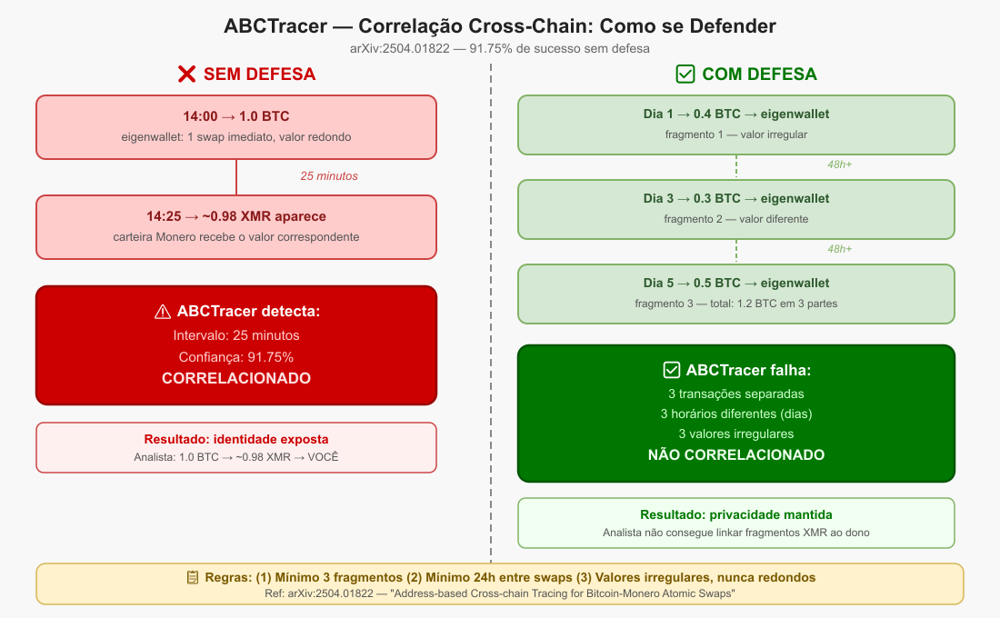
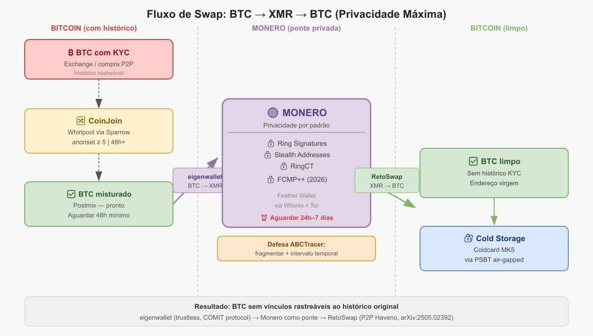

# Capítulo 10 — Nível 5: O Trocador

> "A ponte entre mundos"

---

## Objetivo

Executar swaps BTC↔XMR com segurança e proteção contra correlação temporal (ABCTracer).

**Tempo estimado:** 1–2 semanas | **Dificuldade:** ★★★★★

**Pré-requisitos:** Nível 4 concluído + UTXO pós-coinjoin disponível.

---

### Passo 5.1 — Estudar atomic swaps e Monero

```
Conceitos para pesquisar:

□ O que é um atomic swap?
 - Troca entre blockchains sem intermediário
 - Contrato HTLC garante que ninguém rouba ninguém
 - Se falhar, reembolso automático

□ Por que Monero para privacidade?
 - Bitcoin: blockchain pública, todas as transações visíveis
 - Monero: Ring Signatures (16 decoys), Stealth Addresses, RingCT
 - Ninguém vê: quem enviou, quanto enviou, para quem

□ O que é ABCTracer?
 - Paper de 2025 (arXiv:2504.01822)
 - Demonstrou 91,75% de rastreabilidade cross-chain
 - Usa 3 sinais: intervalo de tempo, proporção valor/fee, endereço destino
 - NOSSA DEFESA: esperar, variar valores, usar endereços virgens

□ O que é FCMP++?
 - Upgrade do Monero previsto para 2026
 - Expande anonimato para blockchain INTEIRA
 - Quando ativado, privacidade fica ainda mais forte
```



---

### Passo 5.2 — Instalar Feather Wallet (XMR)

```
□ Baixar Feather de featherwallet.org
□ Verificar assinatura PGP
□ Instalar no Whonix
□ Criar carteira Monero:
 - Seed Monero de 25 palavras (PADRÃO DIFERENTE do Bitcoin)
 - NUNCA usar a mesma seed do Bitcoin
 - Gravar seed XMR em metal (Lei 4) — **nunca** no KeePassXC
 - Anotar no KeePassXC: restore height, labels, subendereços usados
 - Senha forte para abrir a carteira
□ Conectar a nó .onion (Tor integrado nativo)
```

---

### Passo 5.3 — Instalar eigenwallet (BTC→XMR)

```
□ Baixar de eigenwallet.org
□ Verificar assinatura PGP (binarybaron)
□ No Whonix, usar scurl-download:
 scurl-download https://github.com/eigenwallet/core/releases/download/4.11.3/eigenwallet_4.11.3_amd64.AppImage
 scurl-download https://github.com/eigenwallet/core/releases/download/4.11.3/eigenwallet_4.11.3_amd64.AppImage.asc
 gpg --verify eigenwallet_4.11.3_amd64.AppImage.asc eigenwallet_4.11.3_amd64.AppImage

□ Tornar executável e rodar
□ eigenwallet detecta Tor automaticamente (porta 9050)
```

---

### Passo 5.4 — Instalar RetoSwap (XMR→BTC e fiat)

```
□ Baixar RetoSwap v1.8.0-reto (jun/2026) — github.com/retoaccess1/haveno-reto/releases
  ⚠️ Versões anteriores a 20/06/2026 foram descontinuadas por atualização de protocolo
□ Verificar assinatura PGP
□ Instalar no Whonix (persistente)
□ Criar conta (avatar, sem email)
□ Familiarizar-se com a interface

□ PARA QUE SERVE:
 - Swap XMR→BTC (caminho inverso)
 - Comprar XMR com dinheiro físico/fiat
 - Vender XMR por dinheiro físico/fiat
```

---

### Passo 5.5 — Preparar primeiro swap BTC→XMR (TESTE)



```
□ Sparrow: isolar 0.003 BTC (pós-coinjoin) em Swap_Ready_Whonix
□ Feather: Receive → New address (subendereço VIRGEM)
 - Anotar no KeePassXC com timestamp
□ Sparrow: Addresses → endereço VIRGEM para change (troco)
 - Anotar no KeePassXC

□ eigenwallet:
 - List Sellers → escolher maker com boa reputação
 - Inserir endereço XMR (Feather) e endereço BTC change
 - Criar transação swap
```

---

### Passo 5.6 — Assinar e aguardar swap

```
□ Salvar PSBT do eigenwallet
□ Dispositivo air-gapped → assinar PSBT
□ Carregar PSBT assinado → transmitir
□ AGUARDAR (25–90 minutos)
 - Não fechar o Whonix/Tails
 - Não suspender o computador
 - Monitorar status no eigenwallet

□ Feather → History → XMR aparece
□ Aguardar 10 confirmações Monero (~20 min)
□ Verificar valor (menos fee do maker, 1.5-20%)
□ Registrar TUDO no KeePassXC:
 - TXID swap BTC, TXID recebimento XMR
 - Valor, timestamp, maker usado
```

---

### Passo 5.7 — Aplicar intervalo de segurança

```
⚠️ DEFESA CRÍTICA CONTRA ABCTRACER:

□ NUNCA fazer o swap de volta imediatamente
□ Aguardar MÍNIMO 24 horas (ideal: 3-7 dias)
□ Durante este intervalo:
 - Fechar Whonix/Tails
 - Fazer OUTROS swaps com outros UTXOs
 - Usar valores DIFERENTES em cada swap
□ Depois do intervalo: churn Monero (opcional)
 - Feather → nova carteira → enviar XMR para ela
 - ⚠️ Nova seed = novo backup em metal antes de mover fundos
 - Aguardar +1 hora
 - Quebra vínculo de valor
```

---

### Passo 5.8 — Swap reverso XMR→BTC

```
⚠️ CORREÇÃO IMPORTANTE (v1.1):
eigenwallet atualmente tem BTC→XMR como taker.
Para XMR→BTC, use RetoSwap ou BasicSwap.

□ Opção A: RetoSwap
 - Procurar oferta XMR→BTC
 - Verificar reputação do comprador
 - XMR entra em escrow multisig
 - Receber BTC em endereço VIRGEM do dispositivo air-gapped
 - Tempo: horas a dias (depende de contraparte)

□ Opção B: BasicSwap DEX (avançado)
 - Atomic swap trustless total
 - Requer Docker + nós completos (~400GB)
 - Sem taxas de maker/taker
 - Instalar só se realmente precisar

□ BTC recebido é "virgem" (sem histórico KYC)
□ Vai DIRETO para cold storage (dispositivo air-gapped)
```

---

### Passo 5.9 — Conhecer FCMP++ (futuro próximo)

```
□ FCMP++ = Full-Chain Membership Proofs
□ Expande anonymity set Monero de 16 para blockchain INTEIRA
□ Stressnet desde outubro 2025; beta oficial v0.19.0.0 lançado em 6 mai/2026
□ Mainnet prevista para 2026 (não ativada ainda em jun/2026)
□ Quando ativado:
 - Swaps ficam ainda mais privados
 - Defesa contra ABCTracer fica criptograficamente mais forte
□ NÃO requer ação sua — upgrade automático do Monero
□ Mas ENTENDA o impacto: sua privacidade vai melhorar
```

---

### Verificação do Nível 5

**Obrigatório antes de swap com valor significativo:**

```
□ Primeiro swap BTC→XMR concluído com sucesso (teste pequeno)
□ Intervalo de 24h+ respeitado antes do reverso
□ Entendo ABCTracer e minhas defesas (tempo, valor, endereços)
□ Sei que eigenwallet é para BTC→XMR, RetoSwap para XMR→BTC
```

**Ambiente configurado:**

```
□ RetoSwap instalado para swap reverso XMR→BTC
□ TXIDs e metadados registrados no KeePassXC (sem seeds)
□ Feather com restore height anotado
□ Conheço FCMP++ e seu impacto futuro
```

---

## 🏅 Conquista: "O Trocador"

> Atravesso a ponte entre blockchains sem pedir licença. Meu Bitcoin some como Monero. Meu Monero renasce como Bitcoin limpo. O rastro se perde na névoa — e a névoa vai ficar ainda mais densa.

---

No próximo capítulo, integraremos todos os componentes no ecossistema pessoal — Nível 6, O Soberano.

---

## 📎 Leitura opcional — após Nível 5

As seções abaixo aprofundam fluxo BTC↔XMR, ABCTracer, eigenwallet passo a passo, cenários de uso e restore height Monero. **Não são obrigatórias** para concluir o Nível 5.

---

## Aprofundamento: Fluxo BTC→XMR→BTC e Defesas ABCTracer

Bitcoin é transparente por design — todo saldo e transação é público para sempre. Monero foi construído do zero para privacidade. A comunidade usa XMR como **"ponte de privacidade"**: você entra com BTC, passa pelo XMR, e sai com BTC limpo sem rastro criptográfico.

Bitcoin (BTC) blockchain pública rastreável 100% Chainalysis vê tudo swap Monero (XMR) Ring Signatures (16 decoys) Stealth Addresses (one-time) RingCT (oculta valores) FCMP++ (2026 → set total) ninguém consegue seguir o rastro → swap BTC (novo) endereço fresco sem link com origem auto-custódia Monero como "ponte de privacidade" — a estratégia da comunidade O rastro é cortado durante a passagem pelo XMR — nenhum analista de blockchain consegue atravessar

**Por que não usar CoinJoin só no Bitcoin?** CoinJoin (Whirlpool, JoinMarket) é a melhor alternativa sem sair do Bitcoin — não-custodial, sem KYC. Mas ainda deixa rastros probabilísticos em análise sofisticada. Para privacidade criptograficamente forte, o XMR é mais robusto. Muitos Bitcoiners usam os dois: CoinJoin antes de entrar no XMR, e novo endereço na saída.

**⚠ Fronteiras do swap são visíveis nos dois lados.** Um paper de 2025 (ABCTracer, arXiv:2504.01822) demonstrou 91,75% de rastreabilidade cross-chain usando 3 sinais: intervalo de tempo, proporção valor/fee, e endereço de destino. Defesa: dividir o valor em partes diferentes, em horários diferentes, com endereços diferentes.

Fluxo completo de auto-custódia BTC com camada de privacidade XMR. Cada passo representa uma decisão de trade-off entre conveniência e privacidade.

1

Preparar o BTC de saída — coin control + CoinJoin

No Sparrow Wallet, use coin control para selecionar os UTXOs que deseja privatizar. Opcionalmente, rode um ciclo de Whirlpool/JoinMarket antes do swap. Isso adiciona entropia extra antes mesmo de entrar no XMR.

Sparrow → UTXOs → CoinJoin (opcional) → endereço de envio

2

Gerar um subendereço XMR fresco

No Feather Wallet ou Cake Wallet, crie um subendereço novo para cada swap (nunca reutilize). O Monero usa stealth addresses — cada pagamento já gera um endereço único, mas ter um subendereço separado por operação é melhor higiene.

Feather/Cake → Receive → New subaddress

3

Realizar o swap BTC → XMR (ver aba Ferramentas)

Escolha o método pelo seu perfil: eigenwallet/COMIT para atomic swap trustless, Haveno/RetoSwap para P2P com fiat, BasicSwap para DEX auto-hospedado. Sempre via Tor. Sempre com endereço XMR fresco.

4

Aguardar — defender contra correlação de tempo

Não faça o swap de volta imediatamente. Espere pelo menos algumas horas, idealmente dias. Varie o intervalo entre operações. Isso derrota o principal vetor de deanonimização: correlação temporal entre entrada e saída do XMR.

5

Swap XMR → BTC com valor diferente e endereço fresco

Ao sair do XMR, use um valor ligeiramente diferente do que entrou (taxa + variação intencional). Receba em um endereço Bitcoin completamente novo, gerado na sua hardware wallet, que nunca foi usado antes.

XMR → swap → novo endereço BTC (HW wallet)

6

Cold storage — HW wallet air-gapped

O BTC que saiu do XMR vai direto para cold storage: Coldcard, SeedSigner, Passport ou Jade em modo air-gapped. Chaves privadas nunca tocam computador online. Sparrow ou Electrum fazem o watching-only.

Cada ferramenta representa um ponto diferente no espectro: conveniência ↔ trustlessness ↔ liquidez ↔ complexidade técnica.

eigenwallet (ex-UnstoppableSwap)

Atomic

COMIT protocol · GUI desktop · Linux/Mac/Win

Atomic swap BTC → XMR trustless: sem custodian, sem KYC, garantia criptográfica. Se falhar, reembolso automático. Renomeado de UnstoppableSwap. Commits ativos até 2026. Taxa dos makers varia entre 1.5–20%; confirmar antes. Tempo: ~25–60min. Mínimo ~0.003–0.01 BTC.

TrustlessSem KYC 10/10Tor nativoSó BTC→XMR

Haveno / RetoSwap

P2P

Fork do Bisq · Multisig XMR · Tor · Whonix compatível

P2P descentralizado. Permite comprar XMR com fiat (transferência bancária, dinheiro físico, Revolut) sem KYC. Escrow multisig 2/3 com árbitro. Único que conecta fiat ao mundo cripto sem custodian. Volume ~$5–10M/dia em 2026.

Fiat sem KYCNão-custodialTor nativoHoras por trade

BasicSwap DEX

Atomic

Particl Project · Docker · self-hosted · MIT

DEX auto-hospedado com atomic swaps via adaptor signatures. Sem taxas de maker/taker — só taxas de mineração. Score 9.1/10 no NoKYCZone. Exige Docker + nós completos (Bitcoin + Monero = ~400GB). Liquidez fina mas trustless total.

Totalmente trustlessSem taxasDocker obrigatórioLiquidez baixa

Feather Wallet

Desktop XMR

Monero wallet leve · Tor nativo · Linux/Win/Mac

Wallet Monero desktop leve com integração Tor nativa. Não faz swap diretamente, mas é o melhor cliente XMR para gerenciar fundos entre os swaps. Alternativa ao Monero GUI — mais rápido, menos recurso.

Tor integradoLeveXMR only

Cake Wallet

Mobile

iOS + Android · Multi-coin · Swap integrado

Escolhido pela comunidade como sucessor do MyMonero (encerrado jan/2026). Suporta BTC, XMR, ETH, LTC, SOL em um app. Swap integrado (roteado via aggregators). Não-custodial. Para uso casual no celular — não para grandes quantias.

Não-custodialMulti-coinSwap via terceirosMobile hot wallet

JoinMarket

CoinJoin BTC

Bitcoin-only · Não-custodial · Tor · pré-swap

Alternativa ao Whirlpool para CoinJoin não-custodial dentro do Bitcoin, antes de entrar no XMR. Você pode ser "maker" (ganhar fee) ou "taker" (pagar). Roda sobre Tor. Complementar ao fluxo BTC→XMR→BTC para maximizar privacidade.

Não-custodialTorCoinJoinTécnico

**ABCTracer (arXiv:2504.01822, abril 2025):** pesquisadores demonstraram 91,75% de rastreabilidade cross-chain em bridges usando 3 sinais simultâneos: intervalo de tempo, proporção valor/taxa, e endereço de destino. Isso afeta qualquer swap — incluindo BTC↔XMR — quando feito descuidadamente.

⚔

Ataque: correlação temporal

**Vetor:** você envia 1.0 BTC e 1.0 BTC equivalente em XMR aparece minutos depois em outro endereço. Um analista correlaciona pelo horário e valor. 
**Defesa:** espere horas ou dias entre entrada e saída do XMR. Varie os intervalos. Nunca faça round-trip imediato.

⚔

Ataque: fingerprint de valor

**Vetor:** 1.5000 BTC entram no swap e 1.5000 BTC (menos fee) saem do outro lado. A proporção exata é uma assinatura. 
**Defesa:** divida em partes menores e com valores diferentes. Ex: 0.4, 0.6, 0.5 BTC em três swaps separados, em horários distintos.

⚠

Vulnerabilidade Haveno (arXiv:2505.02392, maio 2025)

**Descoberta:** certas transações do Haveno podem ser detectadas on-chain, permitindo vincular transações Monero às contrapartes Bitcoin. O Haveno tem seed nodes centralizados (diferente de BasicSwap e COMIT), o que cria ponto de falha e vetor de análise. 
**Defesa:** usar BasicSwap ou eigenwallet para trustlessness total; esperar correções do Haveno.

✓

Upgrade FCMP++ (previsto mainnet 2026)

**O que é:** Full-Chain Membership Proofs — expande o anonymity set de 16 decoys (ring size atual) para _toda a blockchain Monero_. Em stressnet desde outubro de 2025; beta oficial v0.19.0.0 lançado em 6 mai/2026. Mainnet não ativada ainda em jun/2026. Quando ativado, torna rastreamento de saídas XMR criptograficamente inviável mesmo com recursos estatais.

✓

Sempre via Tor — esconder o IP da transação

Mesmo que a blockchain seja privada, seu IP ao fazer o swap é metadado valioso. eigenwallet suporta Tor nativamente. Haveno/RetoSwap roda perfeitamente no Whonix. BasicSwap é auto-hospedado. Para o XMR: Feather Wallet tem Tor nativo.

---

## Tutorial: eigenwallet no Whonix — Passo a Passo

eigenwallet detecta automaticamente o Tor daemon do Whonix — não precisa configurar proxy manual. Todo tráfego passa pelo Gateway Whonix.

0

Pré-requisito: Whonix rodando (Gateway + Workstation)

Sempre suba o Gateway antes. Confirme conexão Tor: `curl --socks5-hostname 127.0.0.1:9050 https://check.torproject.org/api/ip` na Workstation.

1

Baixar o eigenwallet (AppImage) via scurl-download

Use o `scurl-download` do Whonix (wrapper seguro do curl via Tor). Baixe da página oficial do GitHub.

scurl-download https://github.com/eigenwallet/core/releases/latest/download/eigenwallet-x86\_64.AppImage scurl-download https://github.com/eigenwallet/core/releases/latest/download/eigenwallet-x86\_64.AppImage.asc

2

Verificar assinatura GPG — obrigatório

Nunca execute sem verificar. O projeto assina as releases com chave GPG do mantenedor (@binarybaron).

\# Importar chave pública scurl https://eigenwallet.org/binarybaron.asc | gpg --import # Verificar o AppImage gpg --verify eigenwallet-x86\_64.AppImage.asc eigenwallet-x86\_64.AppImage # Saída esperada: # gpg: Good signature from "binarybaron ..."

3

Tornar executável e rodar

AppImage não precisa de instalação. Basta tornar executável e rodar. O eigenwallet detecta o Tor daemon do Whonix automaticamente na porta 9050.

chmod +x eigenwallet-x86\_64.AppImage ./eigenwallet-x86\_64.AppImage

4

Instalar Feather Wallet para receber o XMR

O eigenwallet cria uma carteira XMR temporária interna, mas para auto-custódia real você quer o XMR no seu próprio Feather Wallet. Gere um subendereço fresco antes de iniciar o swap.

\# Feather Wallet — AppImage disponível para Linux scurl-download https://featherwallet.org/files/releases/linux/feather-2.x.x-x86\_64.AppImage # → File → New Wallet → Receive → New address (gera subendereço) # → Copie o endereço XMR para usar no swap

5

Preparar endereços BTC no Electrum/Sparrow

Você precisa de dois endereços BTC: um para enviar (origem) e um de troco (change). Ambos devem ser de wallets na sua custódia. No eigenwallet, o endereço de change recebe qualquer BTC não consumido.

\# No Electrum (Workstation): # Addresses → fresco (nunca usado) → copie # Um endereço para change, outro para eventual recebimento de BTC # Confirme que o Electrum está conectado via .onion: # Tools → Network → Server → seu ElectrumX .onion

6

Executar o swap — fluxo no GUI

No eigenwallet GUI: listar sellers → escolher pelo preço e reputação → definir valor → colar endereços → confirmar → aguardar (25–90 min).

\# Fluxo CLI alternativo (mais privado): swap list-sellers --tor-socks5-port 9050 swap buy-xmr \\ --receive-address SEU\_ENDERECO\_XMR\_FEATHER \\ --change-address SEU\_ENDERECO\_BTC\_CHANGE \\ --seller /dns4/SELLER.onion/tcp/8765/p2p/12D3... --tor-socks5-port 9050

7

Persistência — salvar estado do swap

O eigenwallet grava estado do swap localmente (em caso de interrupção, o swap pode ser retomado). No Whonix, configure um diretório persistente cifrado para guardar esses dados entre sessões.

\# Dados do eigenwallet ficam em: ~/.local/share/eigenwallet/ # Para persistir entre boots no Whonix: # Whonix → Settings → Persistent Storage → enable # → vincule ~/.local/share/eigenwallet/ ao storage persistente cifrado

Três cenários reais de uso — do mais simples ao mais robusto. Cada um representa um ponto diferente no trade-off entre conveniência e privacidade.

🔀 Cenário 1: BTC de exchange → privacidade via XMR

Uso moderado · quebrar rastro de KYC

BTC que veio de exchange KYC (Coinbase, Binance, etc.) está ligado à sua identidade. Fluxo: Sparrow (coin control) → eigenwallet (BTC→XMR) → aguardar dias → RetoSwap (XMR→BTC) → Coldcard/Sparrow endereço novo.

Quebra rastro KYC2–7 dias totalTaxa ~2–3%

💵 Cenário 2: Fiat cash → XMR → BTC

Uso moderado · entrada sem KYC

Comprar XMR com dinheiro em espécie via RetoSwap/Haveno (método: cash by mail, Pix sem nome ou Revolut). XMR chega na carteira. Depois: RetoSwap (XMR→BTC) → Coldcard. Nunca houve KYC em nenhuma etapa.

Zero KYC · RetoSwap + eigenwallet · Dias a semanas

🧊 Cenário 3: Saída para cold storage final

Auto-custódia · destino final dos sats

Após o XMR→BTC no RetoSwap, o BTC limpo vai direto para endereço da HW wallet air-gapped (Coldcard/SeedSigner). Nunca fica em hot wallet. O Sparrow em modo watching-only monitora o saldo sem expor chaves.

Air-gapped finalPSBT signingSparrow watching-only

🔄 Cenário 4: Fluxo contínuo (uso recorrente)

Dev / uso frequente · Whonix permanente

Whonix Workstation permanente com Electrum + Feather + eigenwallet + RetoSwap instalados. Cada operação usa endereço fresco. Dados persistidos em volume cifrado. Sem reiniciar do zero a cada uso.

PersistênciaMulti-toolRequer disciplina

**Limitação atual do eigenwallet:** a direção padrão é BTC→XMR (você é o "taker"). Para XMR→BTC você precisa ser "maker" (postar oferta e aguardar), o que exige mais configuração e que o Whonix fique online aguardando. Para XMR→BTC simples, RetoSwap é mais prático por enquanto.

Roadmap realista: começa simples, evolui conforme o conforto técnico. Cada fase é funcional e segura por si mesma — não precisa pular etapas.

FASE 1 — Agora · Tails (amnésico)

Tails + eigenwallet + Feather + Coldcard

Boot do Tails, download do eigenwallet AppImage + Feather via Tor Browser, swap pontual BTC→XMR, desliga. Tudo some. Coldcard guarda o BTC final. Limitação real: RAM (~8GB mínimo recomendado), sem persistência nativa fácil para dados do swap em andamento. **Mas para uso eventual é perfeito.**

FASE 2 — Próximo passo · Whonix no VirtualBox

Whonix (VirtualBox) + eigenwallet persistente + Feather

Instalar Whonix no VirtualBox no seu sistema atual (Linux ou Windows). Workstation cifrada com volume persistente. eigenwallet e Feather instalados com dados salvos entre sessões. Permite swaps mais longos sem interrupção. Host OS ainda é ponto de risco.

FASE 3 · Whonix no KVM (Linux dedicado)

Linux dedicado (host) + KVM + Whonix + eigenwallet + ElectrumX local

Host OS Linux limpo dedicado a essa função. Whonix via KVM (mais performance que VirtualBox). Electrum conectado ao seu ElectrumX local via Tor .onion. eigenwallet + RetoSwap + Feather como stack completo. Nó Bitcoin local opcional para broadcast via Tor.

FASE 4 · Qubes + Whonix (nível máximo)

Qubes OS + Whonix VMs isoladas por função

VM separada para cada função: uma só para eigenwallet, uma só para Feather, uma só para Electrum watching-only, uma offline para HW wallet signing. Comunicação via qrexec. Nenhuma VM tem acesso irrestrito à rede. Isolamento de identidades entre carteiras.

🗺️ Se fosse eu, hoje, partindo do zero

Começaria exatamente onde você está: **Tails como ambiente de operação** para tudo que envolve chaves e swaps. A limitação de RAM é real mas gerenciável com 16GB no host — e a vantagem de amnésia total pós-sessão é gigante para quem usa de forma ocasional. Nada persiste por acidente. 
 
**O stack que montaria hoje:** 
→ **Coldcard MK5** como HW wallet air-gapped (geração de seed via dice rolls, nunca em dispositivo conectado) 
→ **Sparrow Wallet** no Whonix para watching-only + PSBT coordinator 
→ **Feather Wallet** no Whonix para XMR (subendereço novo por operação) 
→ **eigenwallet** no Whonix para BTC→XMR (atomic swap, trustless) 
→ **RetoSwap** no Whonix para XMR→BTC quando precisar sair do XMR 
 
**O que faria diferente de muita gente:** 
Nunca usaria a seed BIP39 direto no software. A seed fica no Coldcard, ponto. O Sparrow só conhece a xpub. O signing acontece offline via QR ou SD card. Se o Whonix for comprometido, o atacante vê a watching-only wallet — sem chaves, sem fundos. 
 
**Sobre Tails vs Whonix:** 
Tails para operações pontuais de alto risco (swap grande, geração de endereço, auditoria de seed). Whonix para uso recorrente onde você precisa de persistência (eigenwallet precisa salvar estado do swap — se interrompido, retoma de onde parou). Os dois se complementam, não competem. 
 
**A ressalva mais importante:** 
Tecnologia resolve zero se o comportamento for descuidado. O elo mais fraco é sempre humano: fotografar a seed, reusar endereços, fazer o swap imediato sem espera, logar em conta pessoal na mesma sessão. O setup técnico pode ser impecável e a privacidade destruída em 30 segundos de descuido. 
 
**Ritmo recomendado:** 
Fase 1 agora (Tails + eigenwallet + Coldcard) → testar com valor pequeno → ganhar confiança no fluxo → Fase 2 (Whonix KVM) quando quiser persistência real → nunca pular direto para Qubes sem entender cada peça do mecanismo.

**⚠ Ressalva técnica sobre o eigenwallet em 2026:** a direção XMR→BTC como taker ainda não está completamente implementada na GUI. Por ora, para XMR→BTC use RetoSwap. O eigenwallet foca em BTC→XMR para o taker comum. Isso deve mudar com FCMP++ e evolução do protocolo.

**⚠ Ressalva legal (Brasil):** o uso de ferramentas de privacidade cripto não é ilegal no Brasil. Porém, dependendo do volume, podem existir obrigações de declaração à Receita Federal (IN 1888/2019). Privacidade técnica não elimina obrigações tributárias existentes. Consulte um especialista se necessário.

---

## Conceito: Restore Height no Monero

> _"A seed é a chave do cofre. O restore height é o atalho que evita que você cave a montanha inteira para encontrá-lo."_

---

## O Conceito

O Monero funciona sobre uma blockchain — um livro-caixa gigante com milhões de blocos. Quando você cria uma carteira, ela não precisa ler a blockchain inteira desde o bloco 0 (ano 2014), apenas a partir do momento em que **sua carteira passou a existir**. O **restore height** é exatamente isso: o número do bloco no qual sua carteira foi criada (ou o primeiro bloco a partir do qual ela pode ter recebido fundos).

Se você precisar restaurar sua carteira um dia (usando a seed), informar esse número faz com que a sincronização leve **minutos em vez de horas ou dias**.

---

## Por que isso importa para você, operador?

* **Velocidade de recuperação:** Imagine perder o pendrive Tails durante uma viagem. Você pega o backup, restaura a seed no Feather, mas sem o restore height, a carteira vai escanear a blockchain inteira. Com ele, a sincronização é quase instantânea.
* **Privacidade:** Se você restaurar a partir do bloco 0, o nó remoto pode saber que sua carteira é muito antiga e inferir que você é um usuário de longa data. Dar a altura correta limita a janela de observação ao mínimo necessário.
* **Precisão:** Se você errar para menos (altura muito antiga), não perde nada — só fica mais lento. Se errar para mais (altura depois da primeira transação), a carteira pode não "ver" fundos recebidos antes dessa altura e você pode achar que perdeu saldo (não perdeu, mas não aparecerá até ajustar).

---

## Como anotar corretamente

### No momento da criação da carteira (Feather)

Assim que você cria uma nova carteira na Feather, a tela final de confirmação mostra:

```
Wallet created successfully!

Restore height: 3185000
```

**Anote imediatamente** o restore height no KeePassXC. A seed XMR vai para metal (Lei 4), não para software:

```
Nome da carteira: fortaleza_fria
Data: 12/06/2026
Seed XMR: [25 palavras — gravadas em metal, Local A]
Restore height: 3185000 (KeePassXC / metadados)
```

> 📌 **Dica:** Escreva também a data por extenso. A Feather aceita tanto o número do bloco quanto a data no formato `YYYYMMDD`. A data é mais fácil de lembrar, mas a altura é exata.

### Se você já criou a carteira e não anotou

Abra a Feather, vá em **Wallet → Information** (ou clique com o botão direito na carteira e selecione "Information"). Lá estará o campo **"Restore height"** ou **"Wallet creation height"**. Anote-o agora.

---

## Como usar o restore height na restauração

Quando você restaura uma carteira a partir da seed na Feather:

1. Escolha "Restore wallet from seed".
2. Cole as 25 palavras.
3. No campo **Restore height**, insira o número do bloco (ex: `3185000`) **ou** a data no formato `AAAAMMDD` (ex: `20260612`).
4. Avance. A Feather começará a escanear a partir desse ponto.

Se você usar uma data, a Feather converte automaticamente para a altura do bloco do primeiro dia daquela data (que é seguro, pois sempre pega um pouco antes).

---

## E se eu não tiver anotado e já perdi tudo?

Você pode estimar o restore height se lembrar da data aproximada em que criou a carteira ou da data da primeira transação recebida. Use uma ferramenta de conversão de data para altura de bloco Monero, como:

* [https://www.exploremonero.com/tools/date-to-height](https://www.exploremonero.com/tools/date-to-height)
* Ou no próprio explorador local da Feather (se tiver outro nó), mas é mais fácil na web.

Coloque a data estimada e pegue a altura. Sempre escolha uma altura **um pouco antes** (alguns dias a mais) para garantir que nenhuma transação fique de fora. A segurança > velocidade.

---

## Exercício prático (na sua fortaleza de testes)

1. Crie uma carteira de teste chamada `teste_restore`.
2. Anote a seed e o restore height.
3. Mande uma pequena fração de XMR para ela.
4. Delete a carteira da Feather (ou apenas restaure do zero em outra máquina ou pendrive).
5. Restaure-a usando a seed, mas deixe o restore height em branco. Veja quanto tempo demora.
6. Agora restaure de novo usando o restore height correto. **Sinta a diferença.**

---

## Dica de novato que virou operador

Guarde o restore height no **KeePassXC** (metadados). A seed XMR segue a Lei 4: **metal**, nunca KeePassXC nem papel fotografável. A perda do restore height não compromete os fundos, apenas sua paciência na restauração.

---

> _"O profissional não espera o desastre para descobrir o número do bloco. Ele o anota antes, como quem guarda o mapa do tesouro junto com a chave."_

---

## Tutorial Avançado: eigenwallet — Fluxo Completo de Swap

## Parte 1: eigenwallet no Whonix — Swap BTC→XMR (taker) na Workstation

## Pré-requisitos específicos

* Whonix Workstation já configurada (como no guia anterior)
* Sparrow Wallet funcionando com carteira watching-only
* Feather Wallet instalada na Workstation
* Pelo menos um output BTC pós-coinjoin disponível
* Coldcard pronto para assinar PSBTs
* 2-3 horas para o primeiro swap (entre configuração e execução)

## Passo 1 — Entender o modelo de ameaça do eigenwallet

O eigenwallet é um cliente de atomic swap **on-chain**. Isso significa que:

* A transação Bitcoin do swap é **pública na blockchain** — visível para qualquer um
* A transação Monero é privada, mas o vínculo entre o UTXO BTC de entrada e o XMR de saída pode ser inferido se você não tomar cuidados
* **Por isso você só deve alimentar o eigenwallet com BTC pós-coinjoin** — UTXOs com anonset ≥ 5
* O eigenwallet atua como "taker" (você pega ofertas de "makers" que já anunciaram)

No Whonix, o tráfego de rede do eigenwallet sai pelo Tor automaticamente (herdado do Gateway). Isso é bom, mas não suficiente — você precisa garantir que o swap não vaze metadados.

## Passo 2 — Instalar e verificar o eigenwallet

### Download e verificação PGP

Na Whonix Workstation:

```
mkdir -p ~/Applications
cd ~/Applications

scurl-download https://eigenwallet.org/releases/latest/eigenwallet-linux.AppImage

scurl-download https://eigenwallet.org/releases/latest/eigenwallet-linux.AppImage.asc

curl https://eigenwallet.org/binarybaron.asc | gpg --import

gpg --fingerprint binarybaron

gpg --verify eigenwallet-linux.AppImage.asc eigenwallet-linux.AppImage

chmod +x eigenwallet-linux.AppImage
```

### Criar lançador para conveniência

Crie um script `~/start_eigenwallet.sh`:

```
echo "Verificando Tor..."
curl --socks5-hostname 127.0.0.1:9050 https://check.torproject.org 2>/dev/null | grep -q "Congratulations" && echo "Tor OK" || echo "TOR FALHOU - ABORTE"
echo "Iniciando eigenwallet..."
~/Applications/eigenwallet-linux.AppImage &
```

```
chmod +x ~/start_eigenwallet.sh
```

---

## Passo 3 — Configurar o ambiente de swap

### Estrutura de carteiras no Sparrow

Você vai precisar de três "zonas" na sua carteira Sparrow:

| Zona | Carteira Sparrow | Função |
| --- | --- | --- |
| **Premix** | `Whirlpool_Whonix` | UTXOs em processo de coinjoin |
| **Postmix** | `Postmix_Whonix` | UTXOs pós-coinjoin, prontos para uso |
| **Swap Ready** | `Swap_Ready_Whonix` | UTXO específico reservado para o swap atual |

**Por que separar:** Se o swap falhar ou você precisar cancelar, o UTXO volta para `Swap_Ready` e você não contamina os outros UTXOs pós-coinjoin.

Todas as três carteiras usam a **mesma xpub do Coldcard** — são só visões diferentes dos mesmos fundos.

### Preparar um UTXO para swap

1. Na carteira `Postmix_Whonix`, selecione um UTXO com anonset ≥ 5 e valor adequado (ex: 0.01 BTC para teste)
2. Botão direito → **Send to → Swap\_Ready\_Whonix** (carteira de destino)
3. Crie PSBT, assine no Coldcard, transmita
4. Aguarde 1 confirmação

Agora o UTXO está isolado e rotulado para swap.

---

## Passo 4 — Gerar endereços para o swap

### Endereço XMR (recebimento)

No Feather Wallet (aberto na mesma Workstation):

* Receive → New address
* Anote o subendereço no KeePassXC com label: `Swap eigen 2026-06-23 #1`

### Endereço BTC de change (troco)

O eigenwallet precisa de um endereço Bitcoin para onde enviar o troco (se o valor do swap for menor que o UTXO de entrada).

No Sparrow, carteira `Swap_Ready_Whonix`:

* Aba Addresses → selecione um endereço **nunca usado** com derivação BIP84
* Copie o endereço
* Anote no KeePassXC: `Change eigen swap 2026-06-23 #1`

**Crítico:** Use SEMPRE um endereço virgem. Reutilizar endereço de change queima privacidade e pode invalidar o anonimato do coinjoin.

---

## Passo 5 — Executar o swap no eigenwallet

### Iniciar o eigenwallet

```
~/start_eigenwallet.sh
```

O eigenwallet abrirá com interface gráfica (Electron). Ele automaticamente usa Tor (herda do sistema Whonix).

### Escolher o par e direção

* Selecione: **BTC → XMR** (você está vendendo BTC, comprando XMR)
* O eigenwallet mostrará uma lista de "makers" (ofertas disponíveis)

### Analisar as ofertas

Cada maker mostra:

| Campo | Significado |
| --- | --- |
| **Price** | Taxa de câmbio BTC/XMR |
| **Amount** | Valor mínimo e máximo do swap |
| **Reputation** | Histórico de swaps completos |
| **Bond** | Caução depositada pelo maker (penalidade se trapacear) |

Escolha um maker com:

* Pelo menos 10 swaps completos
* Bond alto (mostra compromisso)
* Preço dentro do mercado
* Valor compatível com seu UTXO

### Inserir os dados do swap

O eigenwallet pedirá:

1. **Bitcoin Amount:** Valor do UTXO que você vai usar (ex: 0.01 BTC)
2. **Bitcoin Address (Refund):** O endereço de change que você gerou no Sparrow
3. **Monero Address:** O subendereço do Feather Wallet

Revise três vezes. Um erro no endereço Monero = perda permanente dos fundos.

### Criar a transação Bitcoin do swap

O eigenwallet gerará uma transação Bitcoin que bloqueia seus fundos num contrato atômico.

**Você verá:** "Transaction created. Please sign with your wallet."

### Assinar com Coldcard (PSBT via pasta compartilhada)

O eigenwallet exporta a transação como PSBT ou transação raw. Você precisa:

1. Salvar o PSBT na pasta compartilhada: `/mnt/psbt_bridge/swap_psbt.psbt`
2. No host, copiar para o MicroSD
3. Coldcard → Ready to Sign → selecionar `swap_psbt.psbt` → assinar
4. Copiar PSBT assinado de volta para `/mnt/psbt_bridge/swap_signed.psbt`
5. No eigenwallet, carregar a transação assinada

**Alternativa:** Se você configurou USB passthrough, pode conectar o Coldcard direto na VM e assinar sem MicroSD. Mas o método MicroSD é mais seguro (air-gapped).

### Transmitir e aguardar

Após carregar a transação assinada, o eigenwallet:

1. Transmite a transação Bitcoin (via Tor)
2. Monitora a blockchain Monero (via Tor)
3. Aguarda o maker cumprir a parte dele

**Tempo típico:** 25-90 minutos, dependendo:

* Congestionamento da rede Bitcoin
* Confirmações necessárias (geralmente 10 confirmações Bitcoin + 10 confirmações Monero)
* Velocidade do maker

### Confirmar recebimento

No Feather Wallet:

* Aguardar aparecer o XMR (com 10 confirmações Monero, ~20 min)
* Verificar se o valor bate (menos a taxa do maker, geralmente 1-3%)

---

## Passo 6 — Pós-swap: intervalo de segurança e limpeza

### Intervalo mínimo obrigatório

**Nunca mova o XMR imediatamente após o swap.**

* Mínimo: 24 horas
* Ideal: 3-7 dias, período em que você pode fazer OUTROS swaps com outros UTXOs
* Durante esse intervalo, o XMR fica parado no subendereço do Feather

### Churn Monero (opcional mas recomendado)

Após o intervalo, para quebrar qualquer possível correlação temporal residual:

1. No Feather, crie uma **nova carteira** (seed nova — grave em metal antes de mover fundos)
2. Envie o XMR da carteira do swap para essa nova carteira
3. Aguarde mais 1 hora
4. Agora o XMR está "limpo" para uso

### Registrar o swap no KeePassXC

Crie uma entrada detalhada:

```
=== SWAP EIGENWALLET ===
Data: 2026-06-23 15:30 UTC
Maker: (onion do maker ou ID)
UTXO BTC entrada: txid:index (0.01 BTC, anonset 5)
Endereço BTC change: bc1q...
Subendereço XMR: 8...
Txid swap BTC: abc...
Txid recebimento XMR: def...
Valor recebido XMR: 0.42 XMR
Fee maker: 2%
Status: Concluído
```

---

No próximo capítulo, Nível 6 — O Soberano, mapearemos o ecossistema pessoal completo.
