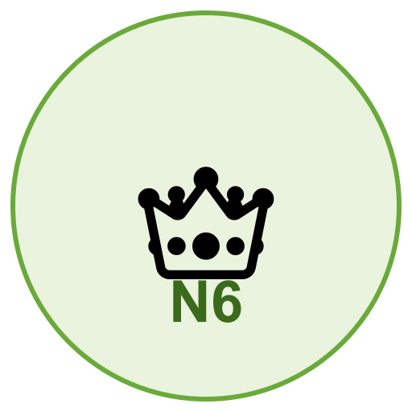

# Capítulo 11 — Nível 6: O Soberano

{fig-align=center width=30mm}

> "O ecossistema completo"

---

## Objetivo

Integrar todos os componentes em um sistema coeso, adicionar camada mobile, dominar entrada/saída sem KYC e conhecer aspectos legais.

**Tempo estimado:** 1–2 meses | **Dificuldade:** 5/5

**Pré-requisitos:** Níveis 0–5 concluídos.

---

### Passo 6.1 — Mapear seu ecossistema pessoal

- [ ] Desenhar seu diagrama completo:
  - Dispositivo air-gapped (Coldcard/Krux/Jade/SeedSigner)
  - Placas de aço (2 locais) + passphrase (local separado)
  - Whonix Workstation (mixagem, carteira)
  - Bitcoin Node VM (validação)
  - EPS .onion (servidor Electrum próprio)
  - Tails USB (swaps cirúrgicos)
  - Mobile (watch-only)

- [ ] Entender como cada peça se conecta
- [ ] Identificar: se X falhar, o que fazer?
- [ ] Guardar diagrama e notas no KeePassXC (metadados — sem seeds)

---

### Passo 6.2 — Configurar ambiente mobile

- [ ] Adquirir celular dedicado:
  - Pixel 6a ou superior (usado, desbloqueado)
  - NÃO use seu celular pessoal do dia a dia

- [ ] Instalar CalyxOS ou GrapheneOS
- [ ] Travar bootloader após instalação
- [ ] Criptografia completa ativada

- [ ] Instalar apps (via F-Droid ou Aurora Store):
  - Sparrow Wallet (watch-only, mesma xpub)
  - Feather Wallet (watch-only, monitorar XMR)
  - KeePassDX (metadados — sem seeds)
  - Orbot (Tor forçado)

- [ ] Alternativa: Cake Wallet
  - Multi-coin (BTC, XMR, ETH, LTC)
  - Swap integrado
  - Para uso CASUAL e valores PEQUENOS
  - NÃO para cold storage

- [ ] Função do mobile:
  - Ver saldo (watch-only, sem chaves)
  - Criar PSBT (QR code)
  - Escanear QR do dispositivo air-gapped
  - Transmitir transação assinada

> Lab complementar: `laboratorio/nivel-6-soberano/02-scripts-operador-tails.md`

---

### Passo 6.3 — Dominar entrada e saída sem KYC

- [ ] Ferramentas que você deve saber usar:

- [ ] RoboSats (Pix → BTC Lightning):
  - Tor Browser → .onion oficial (Apêndice B)
  - Avatar único por trade
  - Escrow Lightning (hold invoices)
  - Ideal para: comprar BTC com Pix

- [ ] RetoSwap (fiat → XMR):
  - Dinheiro físico, transferência, Pix
  - Escrow multisig XMR
  - Ideal para: entrada totalmente anônima

- [ ] Venda direta:
  - Conhecido, encontro presencial
  - Ideal para: simplicidade

- [ ] Diversificar: use TODOS os métodos
  - Não dependa de um só
  - Se um falhar, tem outros

---

### Passo 6.4 — Criar rotina de backups

- [ ] Semanal:
  - Backup da VM Whonix para HD externo cifrado
  - Copiar arquivo .kdbx do KeePassXC (metadados) para HD externo

- [ ] Pré-operação crítica:
  - Snapshot da VM no VirtualBox
  - Nome: "pre_swap_2026-06-23"

- [ ] Mensal:
  - Verificar placas de aço (corrosão, legibilidade)
  - Testar se lembra da passphrase (recitar mentalmente)

- [ ] Trimestral:
  - Atualizar firmware do dispositivo air-gapped
  - Verificar novos .onions (coordenador, EPS)
  - Revisar lista de servidores Electrum

- [ ] Semestral:
  - Simulação de desastre: apagar tudo e restaurar
  - Testar recuperação da seed em dispositivo diferente (metal → HW)

---

### Passo 6.5 — Conhecer aspectos legais (Brasil)

- [ ] **IN 2291/2025 — DeCripto** (substitui a IN 1888 a partir de 01/07/2026):
  - Operações > R$ 35.000/mês sem exchange brasileira: declarar
  - Carteira própria > R$ 5.000: consta no IRPF anual (Bens e Direitos)
  - Ganho de capital: fato gerador de imposto
  - Ver Apêndice E para detalhes completos

- [ ] Swaps e CoinJoin:
  - Tecnicamente são alienações de BTC
  - Se houver ganho de capital, é tributável
  - Consulte contador especializado em criptoativos

> **AVISO:** Privacidade técnica ≠ sonegação fiscal. Você PODE ter privacidade E declarar. A declaração não revela seus endereços, só valores. Este adendo NÃO é consultoria jurídica — consulte um profissional para sua situação.

---

### Passo 6.6 — Ensinar outra pessoa

- [ ] Escolher 1 pessoa de confiança
- [ ] Guiar pelo Nível 0 (Semente)
- [ ] Guiar pelo Nível 1 (Cofre)
- [ ] Verificar que a pessoa ENTENDEU, não só copiou
- [ ] Ensinar solidifica seu próprio conhecimento
- [ ] Se a pessoa não entender "por que", não passa

- [ ] Critério de sucesso:
  - A pessoa consegue restaurar a seed sozinha (metal + dispositivo)
  - A pessoa explica o que é PSBT
  - A pessoa sabe por que nunca fotografar a seed

---

### Passo 6.7 — Diversificar ferramentas

- [ ] Não depender de UMA única ferramenta por função:
  - Mixagem: Whirlpool + JoinMarket
  - Swap: eigenwallet + RetoSwap
  - XMR wallet: Feather + Cake (mobile)
  - Entrada: RoboSats + RetoSwap + venda direta
  - Ambiente: Whonix + Tails

- [ ] Se uma ferramenta sair do ar, você continua operando
- [ ] Atualizar lista de .onions trimestralmente
- [ ] Acompanhar anúncios oficiais (GitHub, Matrix, site do projeto)

---

### Verificação do Nível 6

**Obrigatório antes de se considerar Soberano:**

- [ ] Diagrama pessoal desenhado e compreendido
- [ ] Entrada/saída sem KYC dominada (RoboSats + RetoSwap)
- [ ] Aspectos legais conhecidos (IN 2291/2025 — DeCripto, substitui IN 1888 a partir de 01/07/2026 — consultar profissional)
- [ ] Ferramentas diversificadas (sem ponto único de falha)
- [ ] Consigo restaurar TUDO se perder qualquer componente

**Ambiente e rotina:**

- [ ] Mobile funcional (watch-only — sem chaves)
- [ ] Rotina de backups estabelecida (semanal/mensal/trimestral)
- [ ] Pelo menos 1 pessoa ensinada nos Níveis 0–1

---

## Conquista: "O Soberano"

> Não peço permissão a exchanges. Não confio em servidores públicos. Não exponho minhas chaves. Cada peça do ecossistema tem backup. Cada operação segue um protocolo. Sou soberano sobre meu dinheiro — e a lei conheço, para a liberdade não se confundir com o crime.

---

No próximo capítulo, tornar-se-á Mestre: especialização, comunidade e legado além da soberania pessoal.

---

## Leitura complementar — ecossistema completo

Este capítulo sintetiza **como você opera** como Soberano: diagrama pessoal, mobile watch-only, rotinas de backup, aspectos legais e ensinar outros. Não repete a arquitetura em detalhe — isso é intencional.

| Se você precisa de… | Onde continuar |
| --- | --- |
| Diagramas, swap, matriz, VMs | **Cap. 13 — Ecossistema** |
| Checklist operacional (28 itens) | **Cap. 16 — Checklist** |
| Tutoriais com HW (Feather, Tails) | Pasta `laboratorio/` no repositório |
| Comandos e verificação PGP | **Apêndice C** e **Apêndice D** |

Se algo deste capítulo parecer “resumido demais”, confira o Capítulo 13 antes de concluir que falta conteúdo — a integração está lá; aqui está a **rotina** de quem já montou a fortaleza.

---

## Referência: Regra de Backup 3-2-1

**A regra que salva seu patrimônio digital quando tudo falha**

O backup 3-2-1 é um mantra de sobrevivência:

* **3 cópias** dos dados
* em **2 tipos diferentes de mídia**
* com **1 cópia guardada fora do local** (offsite)

### Rotina 3-2-1 na prática

* **Cópia 1 (original)**: dispositivo ou pendrive principal (já existe).
* **Cópia 2 (backup local)**: segundo dispositivo ou pendrive LUKS, atualizado **semanalmente**. Fica escondido em local diferente do original (Ex.: outro cômodo, gaveta trancada).
* **Cópia 3 (offsite)**: HD externo LUKS, atualizado **mensalmente** ou após grandes transações. Guardado em endereço diferente (casa de parente, cofre bancário).

**Duas mídias diferentes:**

* Pendrive (flash) → mídia 1 (estado sólido).
* HD externo magnético ou SSD externo → mídia 2.
* **Placas de aço** (seeds Bitcoin e Monero) → mídia analógica — Lei 4; não substitua por foto ou papel fotografável.

**Uma cópia offsite:**
Sem isso, um incêndio ou confisco do local onde está o backup local acaba com tudo. A offsite é sua última trincheira.

### Dicas de segurança

* **Nunca armazene a senha do backup LUKS junto com o arquivo de backup.** Use KeePassXC (metadados) ou memória + anotação em local separado — nunca a seed BIP39.
* **Automatize com script.** Crie um script com os comandos de backup, torne-o executável e rode antes de encerrar sessões importantes.
* **Faça um teste de restauração antes de precisar de verdade.** A confiança vem com a simulação bem-sucedida.

A soberania digital não é feita só de bons trades, mas de **cópias que sobrevivem ao caos**. Com esse ritual, nem a morte do dispositivo, nem o confisco, nem o fogo levarão sua fortaleza.

> _"Dois é um, um é nenhum. Três é a paz."_ — Adaptação do ditado militar para o cypherpunk.
