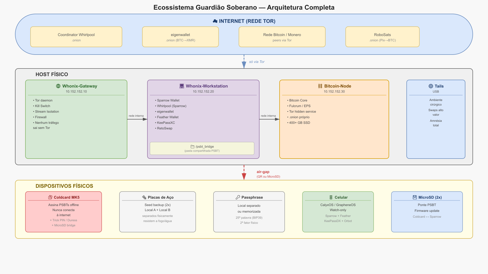

# Capítulo 13 — O Ecossistema Completo

> "Nenhum terceiro tem acesso a tudo ao mesmo tempo"

---

## Objetivo

Apresentar o diagrama completo do ecossistema soberano, explicando como cada componente se conecta e qual sua função na arquitetura geral — incluindo **onde** cada operação deve acontecer (mapa de ambientes, Cap. 13.4–13.8).

---

## 13.1 Visão Geral

Após completar os sete níveis da trilha, você construiu um ecossistema completo de auto-custódia com privacidade. Este capítulo serve como mapa de referência — quando você precisar explicar seu setup para alguém, ou quando quiser revisar se todas as peças estão no lugar.

O ecossistema tem um princípio fundamental: **nenhum terceiro tem acesso a todas as informações ao mesmo tempo.**

- Seu dispositivo air-gapped guarda as chaves, mas nunca vê a internet
- Seu computador vê a blockchain, mas nunca vê as chaves
- Seu nó valida transações, mas não conhece sua identidade
- Seu ambiente de swap opera sobre Tor, mas não guarda estado entre sessões
- Seus backups físicos garantem recuperação mesmo se todos os dispositivos forem perdidos

---

## 13.2 O Diagrama

{fig-align=center width=95%}

O diagrama mostra três camadas principais:

### Camada 1: Internet (Rede Tor)

Todo tráfego do ecossistema passa pela rede Tor. O Whonix-Gateway força isso — nenhum pacote sai sem ser roteado por pelo menos três relays.

### Camada 2: Host Físico

Três máquinas virtuais rodam sobre um hipervisor:

- **Whonix-Gateway:** Força Tor, firewall, kill switch
- **Whonix-Workstation:** Onde você opera Sparrow, Whirlpool, eigenwallet, Feather
- **Bitcoin-Node:** Bitcoin Core + Electrum Personal Server (EPS)

Uma pasta compartilhada (`/psbt_bridge`) conecta o host físico ao mundo air-gapped.

### Camada 3: Dispositivos Físicos

- **Coldcard MK5:** Guarda a seed, assina PSBTs, nunca online
- **Placas de aço:** Duas cópias da seed em locais diferentes
- **Passphrase:** Em local separado, memorizada
- **Celular com CalyxOS/GrapheneOS:** Watching-only para uso diário
- **Pendrive Tails:** Ambiente cirúrgico para swaps de alto valor

---

## 13.3 Inventário de Componentes

### Hardware Físico

| Componente | Função | Custo estimado |
| --- | --- | --- |
| Coldcard MK5 | Assinar transações offline | US$ 170 |
| Placas de aço (2x) | Backup da seed | R$ 100–300 |
| Dados de casino (2x) | Gerar entropia | R$ 10–20 |
| MicroSD (2x) | Ponte PSBT | R$ 40–60 |
| Pendrive USB (2x) | Tails OS | R$ 40–60 |
| Celular Pixel | CalyxOS/GrapheneOS | R$ 1.000–2.000 |
| PC Host (16+ GB RAM) | Virtualização | R$ 3.000–6.000 |

### Máquinas Virtuais

| VM | SO | RAM | Disco | Função |
| --- | --- | --- | --- | --- |
| Whonix-Gateway | Debian (Whonix) | 2 GB | 20 GB | Forçar Tor |
| Whonix-Workstation | Debian (Whonix) | 6 GB | 50 GB | Operação cripto |
| Bitcoin-Node | Debian minimal | 4–8 GB | 400 GB | Validação + EPS |

### Aplicações

| Aplicação | Local | Função |
| --- | --- | --- |
| Sparrow Wallet | Whonix, Tails, Mobile | Coordinator BTC |
| Whirlpool | Whonix (Sparrow) | CoinJoin |
| eigenwallet | Whonix, Tails | Swap BTC→XMR |
| RetoSwap | Whonix | Swap XMR→BTC |
| Feather Wallet | Whonix, Tails, Mobile | Carteira XMR |
| KeePassXC/DX | Todos | Senhas e metadados |
| Electrum | Tails (pré-instalado) | Alternativa BTC |
| Bitcoin Core | Node VM | Validação |
| EPS | Node VM | Servidor Electrum próprio |

---

## 13.4 Mapa de ambientes — não confunda camadas

João sabia usar a Coldcard, o Sparrow e o Tails — mas misturava tudo: abria seed no Tails “só para conferir”, assinava PSBT com o celular pessoal e guardava swap no mesmo pendrive do dia a dia. Nada estava “errado” isoladamente; **juntos**, formavam um mapa mental confuso — e confusão é onde o adversário mora.

Antes de qualquer operação, responda **três perguntas** (grave-as):

> **1. Onde está a seed?** (metal, HW offline, ou — idealmente — em nenhum computador)  
> **2. Onde está a rede?** (Tor forçado, amnésico, ou offline total)  
> **3. Rotina ou cirúrgico?** (Whonix persiste estado; Tails apaga tudo ao desligar)

Se uma resposta contradizer a operação que você vai fazer, **pare** e consulte a tabela abaixo ou o **Apêndice H**.

### Os cinco ambientes (e o que cada um *é*)

| Ambiente | O que é | Rede | Persistência | Seed / chaves privadas |
| --- | --- | --- | --- | --- |
| **Dispositivo air-gapped** | Coldcard, SeedSigner, Krux, AirGap Vault | **Nunca** | Só enquanto ligado (stateless no DIY) | **Sim** — único lugar legítimo para seed |
| **Whonix Workstation** | VM de operação diária | Tor **forçado** (via GW) | Sim (disco VM) | **Nunca** — só xpub, PSBT, metadados |
| **Whonix Gateway** | Roteador Tor | Só Tor | Sim | **Nunca** |
| **Tails** | OS amnésico em pendrive | Tor **forçado** | Opcional (Persistent Storage) | **Nunca** na trilha — exceção: validação Ian Coleman **offline** |
| **Celular dedicado** | CalyxOS/GrapheneOS + Orbot | Tor via Orbot | Sim (dispositivo) | **Nunca** cofre — ver posturas no Cap. 13.5 |
| **Host físico** | Windows/Linux/macOS + VirtualBox | Internet normal | Sim | **Nunca** — assume-se comprometível |

**Air-gap não é “um app”.** É ausência de canal de rede ao dispositivo que guarda a seed. **Tails não substitui air-gap** — substitui o *computador* onde você monta transações sem deixar rastro. **Whonix não substitui Tails** — é onde você *vive* (mixing, swaps, nó); Tails é onde você *entra* para uma operação que deve sumir ao desligar.

### O que **pode** e o que **nunca** pode

| Ambiente | Pode | Nunca |
| --- | --- | --- |
| **HW air-gapped** | Gerar seed, assinar PSBT, verificar endereço no display | Conectar USB/Wi‑Fi/Bluetooth ao host online; fotografar tela com seed |
| **Whonix WS** | Sparrow watch-only, Whirlpool, eigenwallet, Feather, RetoSwap | Digitar seed; colar seed; importar BIP39 completa |
| **Tails** | Compra P2P, swap pontual, RoboSats, sessão “limpa” | Rotina de CoinJoin semanas; guardar seed na persistência |
| **Mobile dedicado** | Ver saldo watch-only; montar PSBT → QR; transmitir tx assinada | Seed principal; valores grandes sem HW; apps de “cofre” no celular pessoal |
| **Host** | Rodar VirtualBox, copiar arquivos para `/psbt_bridge` | Operar carteira com chaves; confiar que “VM protege tudo” |

Desambiguação de nomes parecidos (AirGap Vault vs air-gap genérico): **Capítulo 14.0b**. Matriz compacta: **Apêndice G** e **Apêndice H**.

---

## 13.5 Qual ambiente para qual operação?

Use esta matriz quando o checklist do dia pedir uma ação e você hesitar *onde* abrir o computador.

| Operação | Ambiente recomendado | Alternativa aceitável | Evite |
| --- | --- | --- | --- |
| **Gerar / restaurar seed** | HW air-gapped offline | SeedSigner/Krux DIY (lab) | Tails, Whonix, celular, Ian Coleman online |
| **Validar palavras (checksum)** | Tails **sem rede** ou papel | — | Qualquer site “BIP39 converter” com internet |
| **Ver saldo / UTXOs** | Sparrow na Whonix WS | Mobile watch-only (valores pequenos) | Servidor Electrum público como rotina |
| **Receber BTC** | Sparrow WS (endereço novo) | Mobile watch-only | Reutilizar endereço “por preguiça” |
| **Enviar BTC (cold)** | Sparrow WS → PSBT → HW assina → WS transmite | Mobile monta PSBT → HW assina | Assinar no host sem air-gap |
| **CoinJoin (Whirlpool)** | Sparrow na Whonix WS | — | Tails (estado efêmero quebra rotina); trocar coordinator no meio |
| **Swap BTC → XMR** | eigenwallet na Whonix WS | Tails *(operação única, alto valor)* | Exchange KYC “rápida” |
| **Swap XMR → BTC** | RetoSwap na Whonix WS | Tails pontual | eigenwallet como saída *(trilha usa RetoSwap)* |
| **Comprar sem KYC (BTC)** | Tails + RoboSats | Whonix WS | Conta pessoal logada na mesma sessão |
| **Comprar sem KYC (XMR)** | Tails + Feather/Cake | RetoSwap fiat | — |
| **Operação “nunca existiu”** | Tails amnésico (sem persistência sensível) | — | Whonix com logs e cache |
| **Multisig / herança (N7)** | Sparrow + Specter *(expert)* | Qubes | Mobile |

### Três posturas do celular (N6)

O celular **não é um quarto cofre** — é um **painel de vidro** na parede do cofre:

| Postura | Apps | Seed? | Quando |
| --- | --- | --- | --- |
| **Watch-only** | Sparrow/Feather só xpub | **Não** | Ver saldo, alertas, QR para PSBT |
| **Coordinator leve** | Sparrow monta tx → QR | **Não** | Assinar sempre no HW; transmitir tx assinada |
| **AirGap Vault / similar** | App “cofre” no celular | **Sim, no telefone** | Só valores pequenos ou backup de emergência — **não** substitui Coldcard na trilha |

Lab: `laboratorio/nivel-6-soberano/03-mobile-calyxos.md`. Mapa ferramentas vs trilha: **Cap. 14.0**.

---

## 13.6 Fluxos PSBT por ambiente

O PSBT é a **ponte** entre “mundo online” e “mundo offline”. O mecanismo muda; a regra não: **bytes da transação atravessam; chaves privadas não.**

### Trilha principal: MicroSD + pasta bridge (Whonix / host)

1. Sparrow (Whonix WS) cria PSBT → exporta para `/psbt_bridge` no host (pasta compartilhada com o host físico)
2. Você copia o arquivo para MicroSD **no host** — nunca dentro da VM com rede se puder evitar expor nomes de arquivo sensíveis
3. MicroSD → dispositivo air-gapped → verificar endereço e valor no display → assinar
4. PSBT assinada de volta ao SD → host → `/psbt_bridge` → Sparrow importa → **Transmit** via Tor

Diagrama: imagem `diagrama-psbt.png`. Lab passo a passo: `laboratorio/nivel-2-carteira-fria/02-primeiro-psbt.md`.

### Alternativa: QR animado (SeedSigner, Passport, Jade)

1. Sparrow exibe QR do PSBT (ou fatias animadas)
2. HW escaneia → assina → exibe QR assinado
3. Sparrow escaneia → transmite

**Proibições comuns:** não fotografar QR de PSBT com celular pessoal; não enviar PSBT por e-mail, WhatsApp ou nuvem; não assinar PSBT cujo endereço de destino você não conferiu **no display do HW**.

### Mobile como coordinator (N6)

1. Sparrow mobile (watch-only) cria transação → QR
2. HW air-gapped assina → QR de volta
3. Mobile transmite (Tor/Orbot)

Mesma lógica do SD; o canal é **óptico**. O celular ainda **nunca** vê a seed.

---

## 13.7 Migração Tails → Whonix — o que migra e o que não

No Nível 3 você **sai** do Tails como casa principal e **entra** no Whonix. Isso não é “trocar de carteira” — é trocar de **ambiente operacional**.

| Item | Migra? | Como |
| --- | --- | --- |
| **Seed / chaves privadas** | **Não** | Permanecem no metal + HW; nunca foram no Tails |
| **xpub / descriptor / wallet file Sparrow** | **Sim** | Exportar wallet **sem chaves** do Tails → importar na Whonix WS |
| **Estado Whirlpool (anonset, pools)** | **Parcial** | Reconectar ao mesmo coordinator; UTXOs on-chain migram; **anonset** pode exigir continuidade — não troque de software no meio de um mix |
| **Persistent Storage Tails** | **Não copiar cegamente** | Revise o que havia lá; metadados via KeePassXC; descarte o que não precisa |
| **Hábitos de sessão** | **Sim (mental)** | Tails vira “ferramenta cirúrgica”; Whonix vira “escritório” |

Lab detalhado: `laboratorio/nivel-3-observador/04-migracao-tails-whonix.md`. Comparação longa: **Cap. 8** (aprofundamento Tails vs Whonix).

---

## 13.8 Pasta `/psbt_bridge` — regras de segurança

A pasta compartilhada entre host e Whonix WS é **conveniente e sensível**. Trate como corredor público entre duas salas trancadas.

- **Só PSBTs** — nunca seeds, `.wallet` com chaves, ou backups KeePass com segredos
- **Apague após uso** — PSBT assinada transmitida → remover arquivos da bridge e do SD
- **SD dedicado** — um cartão só para PSBT; não misturar com fotos, ISOs ou outros dados
- **Host assumido hostil** — malware no host pode ler tudo na bridge; por isso a seed **nunca** passa por ali
- **Nome neutro** — evite `coldcard_mainnet_5btc.psbt` visível no explorador de arquivos do host

Se usar QR em vez de SD, a bridge pode ficar vazia — melhor ainda.

---

## 13.9 Fluxos Principais

### Fluxo 1: Depósito → Mixagem → Swap → Cold Storage

1.  Adquirir BTC (RoboSats, RetoSwap, venda direta)
2.  Sparrow mostra UTXO na aba Transactions
3.  Whirlpool: criar Premix → assinar → aguardar rounds
4.  UTXO pós-coinjoin (anonset ≥ 5) → Postmix_Whonix
5.  Isolar 1 UTXO → Swap_Ready_Whonix
6.  eigenwallet: BTC→XMR
7.  Aguardar 24h+ (defesa ABCTracer)
8.  RetoSwap: XMR→BTC (endereço virgem Coldcard)
9.  BTC limpo em cold storage

### Fluxo 2: Recuperação de Desastre

1.  Perdeu VM Whonix → restaurar snapshot/backup
2.  Perdeu Persistent Storage → Restaurar a partir da seed no Sparrow (Arquivo → Restaurar carteira)
3.  Perdeu Coldcard → comprar novo, restaurar seed do aço
4.  Perdeu placa de aço (local A) → usar backup do local B
5.  Esqueceu passphrase → sem recuperação (memorize!)

---

## 13.10 Matriz de Resiliência

| Cenário | Impacto | Recuperação | Tempo |
| --- | --- | --- | --- |
| VM corrompida | Perda do ambiente | Restaurar snapshot | Minutos |
| PS perdido | Perda estado Whirlpool | Restaurar seed Sparrow | 10–40 min |
| USB Tails quebrado | Perda ambiente | Recriar USB | 30 min |
| Coldcard perdido | Sem assinar | Novo HW + seed | 1–7 dias |
| Placa de aço perdida | Sem backup primário | Usar backup local B | Imediato |
| Passphrase esquecida | Carteira real inacessível | Sem recuperação | — |
| Host físico apreendido | Perda das VMs | Restaurar VMs de backup externo | Dias |

---

## 13.11 Custos Totais Estimados

| Categoria | Custo (Brasil) |
| --- | --- |
| Hardware (Coldcard + aço + dados) | R$ 800–1.200 |
| PC Host (se não tiver) | R$ 3.000–6.000 |
| Celular dedicado (usado) | R$ 1.000–2.000 |
| Pendrives e MicroSDs | R$ 100–150 |
| **TOTAL (sem PC)** | **~R$ 2.000–3.500** |
| **TOTAL (com PC)** | **~R$ 5.000–9.500** |

Comparado com o custo de ter fundos confiscados, hackeados ou bloqueados, é um investimento mínimo.

---

## 13.12 Princípios de design: por que cada camada existe

O ecossistema descrito neste livro não nasceu de uma lista aleatória de ferramentas. Cada escolha arquitetural responde a um modelo de ameaça específico. Esta seção explica o "porquê" por trás do "o quê".

### Por que Whonix e não apenas VPN?

Uma VPN substitui seu IP real pelo IP do provedor de VPN. Mas o provedor de VPN ainda vê todo o seu tráfego e pode ser obrigado (por lei, ou por compra) a entregar seus dados. Se o provedor for comprometido ou vendido, seu histórico inteiro vai junto.

O Whonix resolve isso de forma diferente. O Tor roteia seu tráfego por três nós (entry, middle, exit), cada um vendo apenas o fragmento necessário: o nó de entrada sabe quem você é mas não sabe o destino; o nó de saída sabe o destino mas não sabe quem você é; o nó do meio não sabe nenhum dos dois. Mesmo que um nó seja controlado por um adversário, a correlação de tráfego é difícil sem controlar múltiplos nós simultaneamente.

O Whonix-Gateway força que toda a Workstation use o Tor — não é opcional, não pode ser desabilitado por erro, não tem vazamentos de DNS. Essa garantia é estrutural, não dependente de configuração correta.

### Por que air-gap e não hardware wallet conectada?

Hardware wallets como Trezor e Ledger conectam-se via USB ao computador. Isso cria um canal de comunicação entre o dispositivo de assinatura e o ambiente potencialmente comprometido. Ataques sofisticados podem explorar esse canal — e já exploram, em cenários de alta sofisticação.

O air-gap elimina o canal físico. A Coldcard, SeedSigner e Krux nunca conectam à internet ou a computadores ao assinar. O PSBT viaja por QR code ou SD card — meios unidirecionais que um adversário não pode usar para extrair a chave privada.

### Por que duas cópias físicas da seed em locais diferentes?

A regra 3-2-1 existe porque nenhum local é inviolável. Um incêndio, uma enchente, um arrombamento, um descuido — qualquer um desses eventos pode destruir uma cópia. Com duas cópias em locais físicos diferentes, você precisa de dois eventos simultâneos para perder o backup.

A passphrase em um terceiro local adiciona uma camada de segurança lógica: se um ladrão encontrar uma das placas de aço, só tem as 24 palavras. Sem a passphrase, a carteira que ele consegue abrir tem apenas o saldo "decoy" que você colocou lá intencionalmente.

### Por que nó próprio e não servidor Electrum público?

Quando você usa um servidor Electrum público para consultar seu saldo, esse servidor vê quais endereços você está consultando. Se você consultar todos os endereços da sua carteira, o servidor pode inferir sua carteira completa — mesmo que as transações on-chain não a revelem.

Com seu próprio nó Bitcoin Core + EPS (Electrum Personal Server), as consultas ficam no seu servidor. Ninguém vê o que você consulta. Você valida suas próprias transações sem confiar em terceiros para dizer se foram confirmadas ou não.

### Por que Tails para operações cirúrgicas?

O Whonix persiste estado entre sessões — o que é conveniente para mixing contínuo mas deixa rastros em disco. O Tails não persiste nada por padrão (amnésico): ao desligar, tudo desaparece. Nenhuma chave residual, nenhum histórico de conexão, nenhum arquivo temporário.

Para operações que você quer que "nunca aconteceram" do ponto de vista forense — como um swap de alto valor, uma compra em exchange P2P, ou uma operação em viagem — o Tails é o ambiente correto. Nenhuma evidência fica no dispositivo.

---

## Resumo do Capítulo

O ecossistema soberano não é um produto — é uma arquitetura que você constrói. Cada componente tem função específica. Nenhum terceiro controla todas as peças. Você é o ponto central — e também o elo mais importante.

**Para o aluno:** quando sentir vertigem entre Tails, Whonix, air-gap e celular, volte às **três perguntas** (13.4) e à **matriz operação × ambiente** (13.5). Consulta rápida: **Apêndice H**.

Guarde este capítulo como mapa. Quando algo falhar, você saberá exatamente onde está o problema e como recuperar.

---

No próximo capítulo, exploraremos as ferramentas alternativas — o que fazer se o Coldcard não estiver disponível, se o Whirlpool cair, ou se você precisar de um caminho diferente para a soberania.
